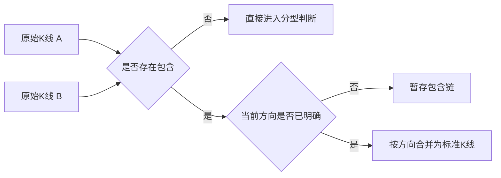
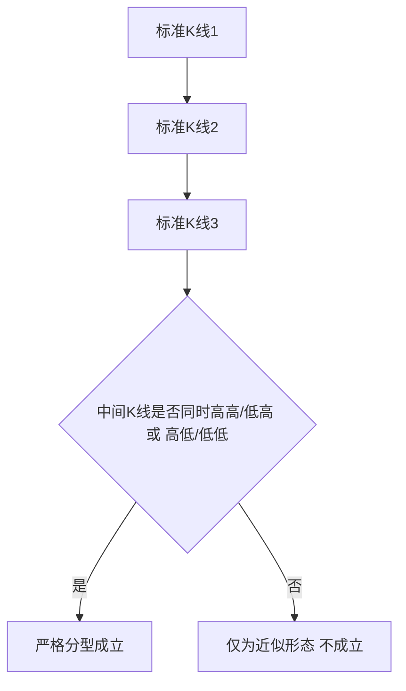
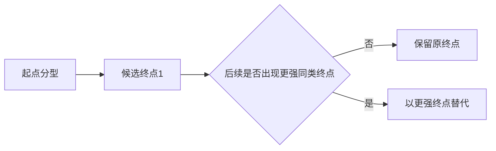
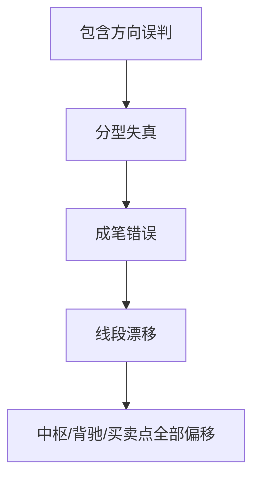

# 基础结构图文化示例库（V1）

本页提供基础结构模块的图文化示例模板，服务于培训、复盘和底层结构 review。

使用原则：

- 所有示例优先说明“标准化后结构是什么”，再谈上层影响。
- 任何近似分型、伪成笔、方向误判都必须给出反例。
- 图示应尽量强调“底层结构错误会污染上层模块”。

## 1. 包含关系处理示例

场景目标：演示为什么必须先判方向，再做包含合并。

图注模板：

- 正确结论：方向未明时先暂存，不能强行合并。
- 错误风险：若默认向上或向下，会直接污染后续分型。

## 2. 严格分型 vs 近似分型示例

场景目标：演示“看起来像分型”但不满足严格三 K 条件的情形。

图注模板：

- 禁止文案：不得把“等高且低点更高”写成严格顶分型。
- 推荐文案：形态接近，但不满足严格三 K 条件。

## 3. 候选终点替代示例

场景目标：演示更强同类终点如何替代旧终点。

图注模板：

- 主结论：候选笔允许延伸，未确认前终点可被替换。
- review 重点：确认“替换”不是“回写已确认笔”。

## 4. 基础结构误差传播示例

场景目标：演示底层结构错误如何传染到上层。

图注模板：

- 结论：先修底层，再修上层。
- 禁止策略：不得用上层结果反向改写底层定义。

## 5. 实盘案例卡片模板

### 5.1 包含链卡片

- 标的/级别/时间窗：
- 当前方向：向上 | 向下 | 未明
- 包含链长度：
- 合并结果：
- 上层影响：

### 5.2 严格分型卡片

- 标的/级别/时间窗：
- 中间 K 线高低点关系：
- 是否成立严格分型：是 | 否
- 反例说明：

### 5.3 成笔替代卡片

- 起点分型：
- 原候选终点：
- 替代终点：
- 是否已确认：是 | 否
- 最终解释：

## 6. 配套文档跳转

- 理论规格：`base-structure-spec.md`
- 原文复核矩阵：`base-structure-original-review-matrix.md`
- 主入口：`chanlun-rule-spec.md`
