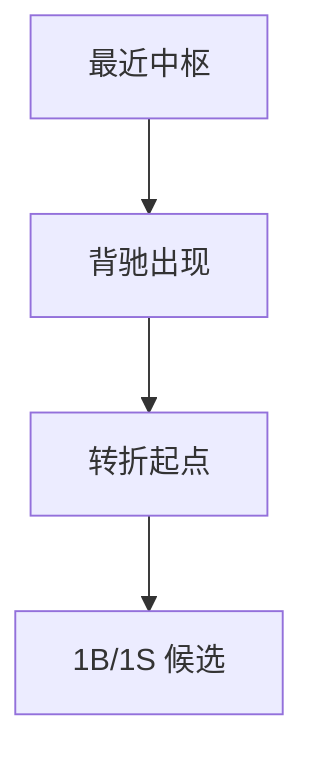
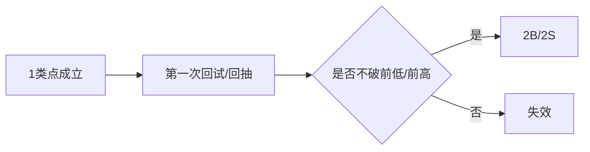
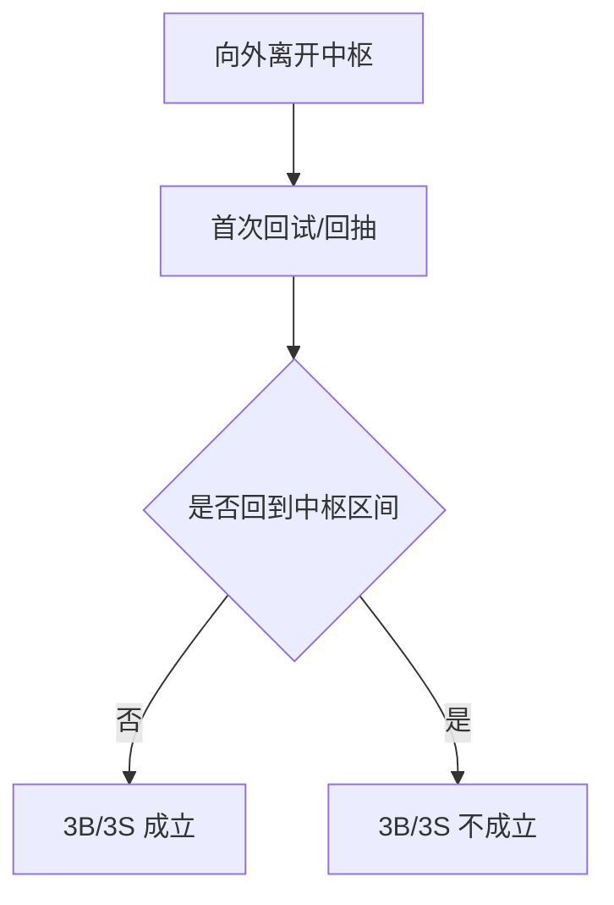
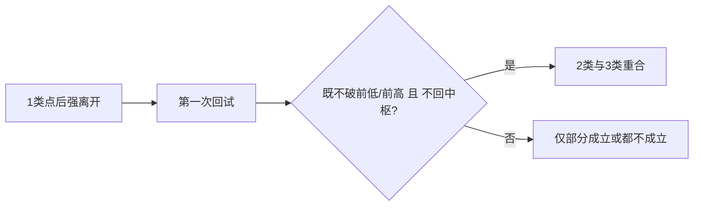
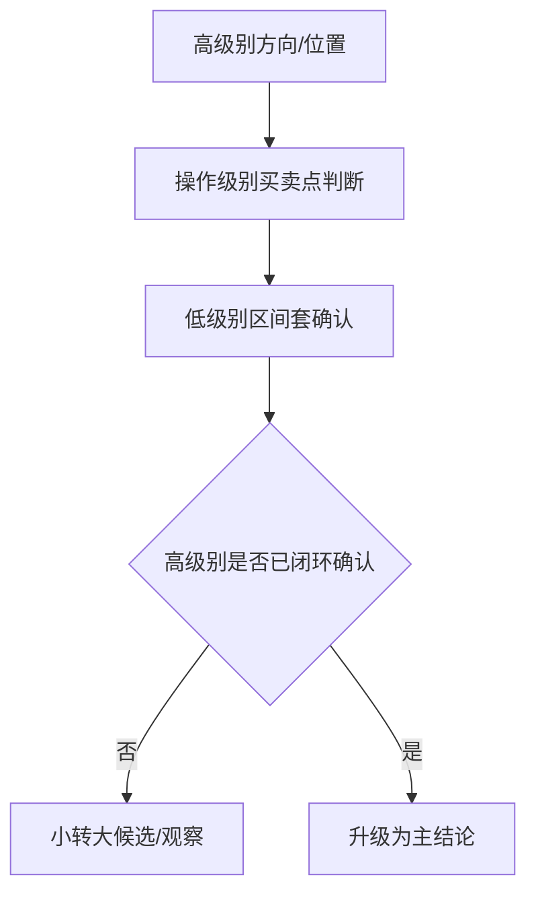
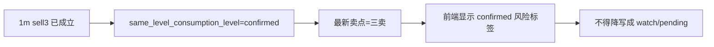
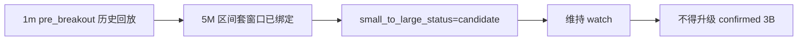

# 买卖点与多级别联立图文化示例库（V1）

本页提供一二三类买卖点、区间套、小转大、多级别联立的图文化示例模板。

使用原则：

- 买卖点示例必须显式绑定最近中枢和所属级别。
- 区间套示例必须区分“判定级别”和“执行级别”。
- 小转大示例必须区分“低级别候选”与“高级别确认”。

## 1. 第一类买卖点示例

场景目标：演示背驰导致的转折起点。

图注模板：

- 必填：最近中枢、背驰对象、所属级别。
- 红线：不得把“仅触边”写成 1 类点。

## 2. 第二类买卖点示例

场景目标：演示转折后的第一次确认性回抽。

图注模板：

- 必填：父 1 类点、第一次回试对象。
- 红线：2 类点必然后置于 1 类点。

## 3. 第三类买卖点示例

场景目标：演示离开中枢后的首次不回归确认。

图注模板：

- 必填：离开段、首次回试序号、最近中枢。
- 红线：第二次回试满足条件，不得回写成同一中枢的 3B/3S。

## 4. 2类与3类重合示例

场景目标：演示在强离开场景下 2 类与 3 类可能重合。

图注模板：

- review 重点：必须同时满足两条语义链。

## 5. 区间套与小转大示例

场景目标：演示低级别只提精度，高级别负责确认。

图注模板：

- 必填：高级别、操作级别、执行级别。
- 必填：`small_to_large_status = candidate | third_class_confirmed`，只表达“小转大候选”或“必要条件已具备”，不得越权写成高级别已确认。
- 红线：低级别信号不得单独推翻高级别未完成结构。

## 6. 实盘案例卡片模板

### 6.1 1类点卡片

- 标的/级别/时间窗：
- 最近中枢：
- 背驰对象：
- 结论：1B | 1S | 不成立

### 6.2 2类/3类点卡片

- 标的/级别/时间窗：
- 父 1 类点：
- 首次回试/回抽：
- 是否重合：是 | 否
- 结论：2B/2S | 3B/3S | 观察

### 6.3 区间套/小转大卡片

- 标的/时间窗：
- 高级别：
- 操作级别：
- 执行级别：
- `precision_entry.status`：`standby` | `watch` | `actionable`
- `precision_entry.small_to_large_status`：`candidate` | `third_class_confirmed`
- 展示文案：`小转大候选` | `小转大必要条件已具备`
- 红线：即使出现 `third_class_confirmed`，也只代表最后一个次级别中枢已出现对应三类买卖点，不等于高级别主结论已确认。

### 6.4 真实卡片 A: 600900 1m 已进入 confirmed 3S，前端必须和候选/必要条件分层展示

- 标的/时间窗：600900 / 1m / 当前实时落盘样本
- 高级别：1m 主结构已完成 confirmed 消费闭环
- 操作级别：1m `same_level_consumption_level=confirmed`
- 执行级别：前端当前主展示不再依赖额外 `5M` 区间套窗口
- 最近卖点：`sell3`
- 展示文案：`偏空，优先减仓或兑现。`
- 结论：这一层已经是 confirmed 卖点消费，不得再和 `watch/pending` 的预警候选卡混成同一种状态标签。

图上 review 重点：

- 这张卡片绑定的是真实 `600900 1m` live 样本，不是 synthetic 对照。
- 当前摘要、latest signal summary 和小程序 technical focus lines 都已经同时给出 `sell3 + confirmed`。
- 它的作用是和 `6.5/6.6` 形成三档分层：confirmed 消费、必要条件已具备、候选观察。
- 对应回归锁的是 `tech.json -> summary/detail -> latest_signal_summary` 的 confirmed 卖点展示链。

### 6.5 回归卡片 B: 5M 出现三买后，小转大仅升级到“必要条件已具备”

- 标的/时间窗：合成回归样本，对应 `tests/test_chanlun_analysis.py` 的 `third_class_confirmed` 用例
- 高级别：上级别买点窗口已激活，且同级别消费为 `confirmed`
- 操作级别：高一级方向已给出，执行层进入可操作窗口
- 执行级别：5M 出现 `buy3`
- `precision_entry.status`：`actionable`
- `precision_entry.small_to_large_status`：`third_class_confirmed`
- 展示文案：`小转大必要条件已具备`
- 结论：最后一个次级别中枢已经出现三买，因此小转大的必要条件成立；但这仍只是必要条件，不得直接偷换为“高级别主结论已确认”。

图上 review 重点：

- 这张卡片是契约/回归卡，不是假装真实行情页内截图；它的作用是把“候选”和“必要条件已具备”两档并排讲清楚。
- `third_class_confirmed` 只表示最后一个次级别中枢已出现对应三类买卖点，不表示高级别反转已经充分确认。
- 与 `6.4` 的区别不在于有没有低级别信号，而在于是否已经出现三买/三卖这个必要条件。
- 对应回归锁的是“出现 buy3/sell3 后 small_to_large_status 必须升级”，不是“高级别主结论同步升级”。

### 6.6 真实卡片 C: 002555 1m -> 5M 区间套已绑定，但仍只作小转大候选观察

- 标的/时间窗：002555 / 1m 截止 2026-08-04 13:35，对应执行级别 5M
- 高级别：1m `pre_breakout` 历史回放，`same_level_decomposition_mode=dual_interpretation_pending`
- 操作级别：1m 当前仍是 `pending`，结论为“震荡，等待方向选择”
- 执行级别：5M 区间套窗口已生成，但未出现三买闭合
- `precision_entry.status`：`watch`
- `precision_entry.small_to_large_status`：`candidate`
- 展示文案：`小转大候选`
- 结论：5M 已经绑定上级别背驰窗口，但最后一个次级别中枢尚未见三买；当前只能作为“小转大候选/观察”，不得把 `pre_breakout` 误写成 confirmed 三买。

图上 review 重点：

- 这张卡片绑定的是真实 replay + miniapp summary/detail 消费链，不是只停留在分析层的孤立字段。
- 上级别 1m 仍是 `pending`，因此即使 5M 已经进入区间套窗口，也只能按 `watch` 消费。
- `small_to_large_status=candidate` 和 `precision_entry.status=watch` 必须同时出现，防止前端或报告把“已有窗口”误读成“已确认买点”。
- 对应回归锁的是 `tech.json -> summary/detail -> precision_window_display` 整条下游展示链。

## 7. 案例 -> 回归锚点映射表

| 案例 | 回归测试 | 绑定说明 |
| --- | --- | --- |
| 一买正例（最近中枢 + 向下离开段跌破下沿 + 底背驰） | `test_analyze_chanlun_signals_flags_first_buy_on_bottom_divergence_below_zs_low` | 背驰导致的转折，非单纯触边 |
| 一卖正例（对称样例） | `test_analyze_chanlun_signals_flags_first_sell_on_top_divergence_above_zs_high` | 顶背驰越过中枢上沿 |
| 一买反例：仅触边不背驰 | `test_analyze_chanlun_signals_does_not_flag_buy1_on_boundary_touch_without_divergence` | 红线：创新低但力度未衰减 -> 不确认 |
| 二买正例（一买后首次确认性回抽） | `test_analyze_chanlun_signals_flags_second_buy_after_buy1_rebound` | `buy1_pullback_confirmation` |
| 二卖正例（对称样例） | `test_analyze_chanlun_signals_flags_second_sell_after_sell1_rebound` | `sell1_rebound_confirmation` |
| 二买易混淆例：中继震荡回抽破前低 | `test_analyze_chanlun_signals_does_not_flag_buy2_on_continuation_pullback_breaking_prior_low` | 破一买前低 -> 二买不成立 |
| 三买正例（离开后首次回抽不回中枢上沿） | `test_analyze_chanlun_signals_flags_third_buy_after_leave_zs_and_pullback_holds_upper_edge` | `leave_zs_then_pullback_holds_upper_edge` |
| 三卖正例（对称样例） | `test_analyze_chanlun_signals_flags_third_sell_after_leave_zs_and_rebound_fails_lower_edge` | `leave_zs_then_rebound_fails_lower_edge` |
| 三买反例：首次回抽重入中枢 | `test_analyze_chanlun_signals_does_not_flag_buy3_when_first_pullback_reenters_zs` | 回抽回到中枢区间 -> 不成立 |
| confirmed 消费真实对照：`600900 1m sell3` | `test_build_summary_and_detail_payload_preserve_real_600900_1m_down_warning_sample` | 真实 `1m` live 样本已形成 `sell3 + confirmed`，前端必须把它和 `watch/pending` 候选卡分层展示，不得降写回预警态 |
| 区间套/小转大必要条件已具备：5M `buy3` 对照卡 | `test_build_lower_timeframe_precision_entry_marks_small_to_large_necessary_condition_when_buy3_sell3_exists` | 次级别已出现 `buy3`，`small_to_large_status` 必须升级到 `third_class_confirmed`，但仍不得把“必要条件成立”偷换成高级别 confirmed |
| 区间套/小转大真实观察链：`002555 1m -> 5M` | `test_build_summary_and_detail_payload_preserve_real_1m_pre_breakout_sample` | 真实 replay `pre_breakout` 已透传到 `precision_entry/precision_window_display`，5M 只能落 `watch + small_to_large_status=candidate`，不得被消费端误写成 confirmed 三买 |

## 8. 配套文档跳转

- 理论规格：`buy-sell-multi-level-spec.md`
- 原文复核矩阵：`buy-sell-multi-level-original-review-matrix.md`
- 主入口：`chanlun-rule-spec.md`
