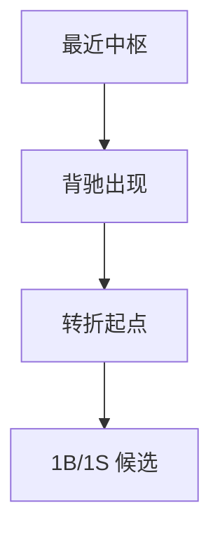
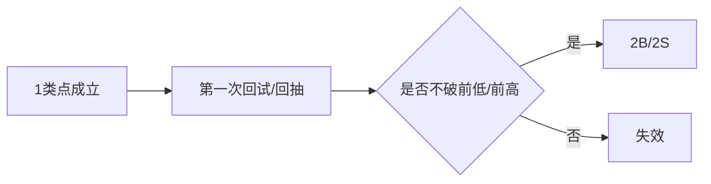
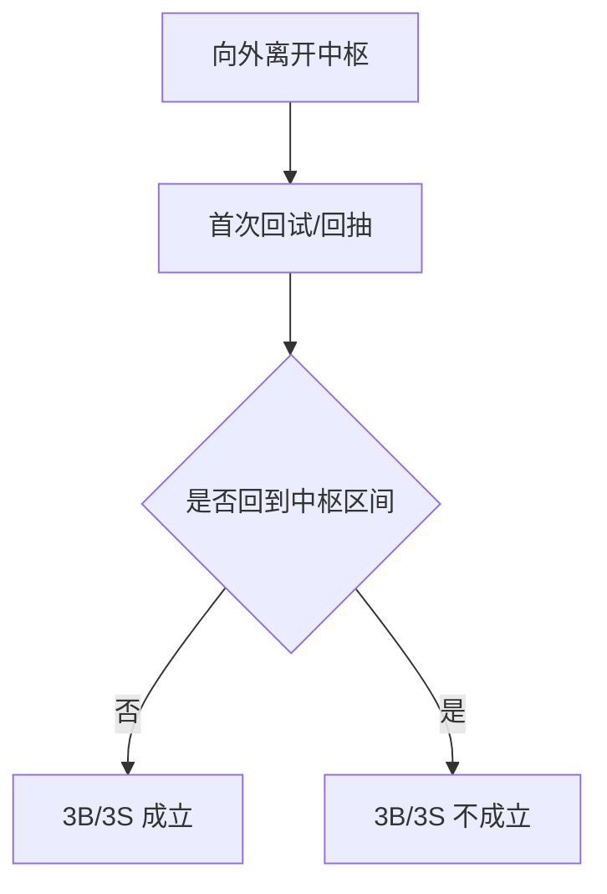
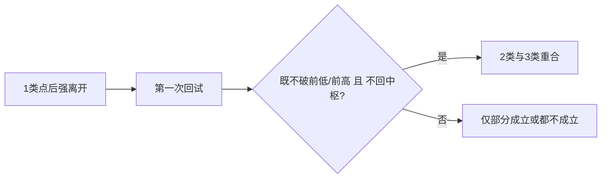
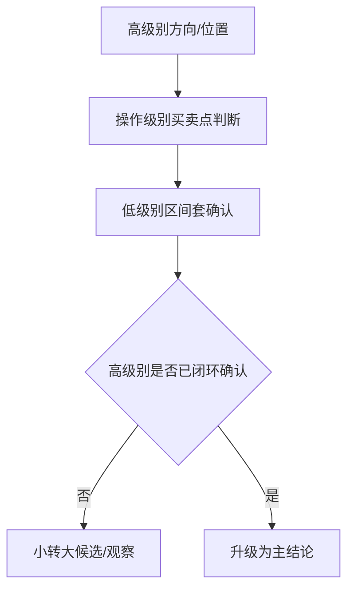

# 买卖点与多级别联立图文化示例库（V1）

本页提供一二三类买卖点、区间套、小转大、多级别联立的图文化示例模板。

使用原则：

- 买卖点示例必须显式绑定最近中枢和所属级别。
- 区间套示例必须区分“判定级别”和“执行级别”。
- 小转大示例必须区分“低级别候选”与“高级别确认”。

## 1. 第一类买卖点示例

场景目标：演示背驰导致的转折起点。

图注模板：

- 必填：最近中枢、背驰对象、所属级别。
- 红线：不得把“仅触边”写成 1 类点。

## 2. 第二类买卖点示例

场景目标：演示转折后的第一次确认性回抽。

图注模板：

- 必填：父 1 类点、第一次回试对象。
- 红线：2 类点必然后置于 1 类点。

## 3. 第三类买卖点示例

场景目标：演示离开中枢后的首次不回归确认。

图注模板：

- 必填：离开段、首次回试序号、最近中枢。
- 红线：第二次回试满足条件，不得回写成同一中枢的 3B/3S。

## 4. 2类与3类重合示例

场景目标：演示在强离开场景下 2 类与 3 类可能重合。

图注模板：

- review 重点：必须同时满足两条语义链。

## 5. 区间套与小转大示例

场景目标：演示低级别只提精度，高级别负责确认。

图注模板：

- 必填：高级别、操作级别、执行级别。
- 红线：低级别信号不得单独推翻高级别未完成结构。

## 6. 实盘案例卡片模板

### 6.1 1类点卡片

- 标的/级别/时间窗：
- 最近中枢：
- 背驰对象：
- 结论：1B | 1S | 不成立

### 6.2 2类/3类点卡片

- 标的/级别/时间窗：
- 父 1 类点：
- 首次回试/回抽：
- 是否重合：是 | 否
- 结论：2B/2S | 3B/3S | 观察

### 6.3 区间套/小转大卡片

- 标的/时间窗：
- 高级别：
- 操作级别：
- 执行级别：
- 当前状态：观察 | 候选 | 已确认

## 7. 配套文档跳转

- 理论规格：`buy-sell-multi-level-spec.md`
- 原文复核矩阵：`buy-sell-multi-level-original-review-matrix.md`
- 主入口：`chanlun-rule-spec.md`
