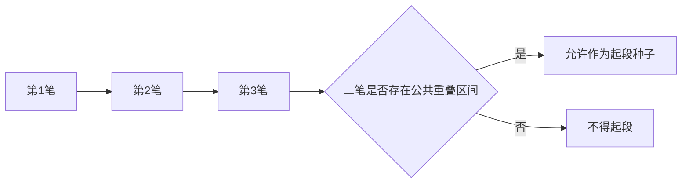
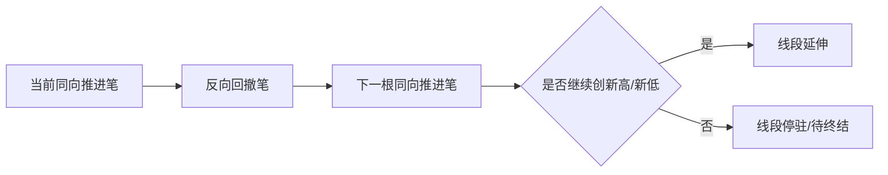
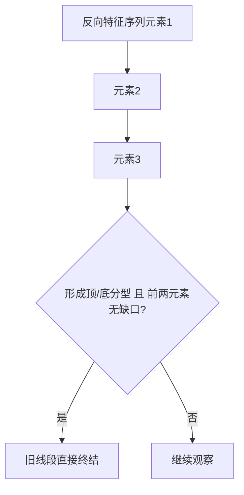
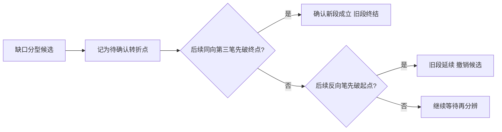
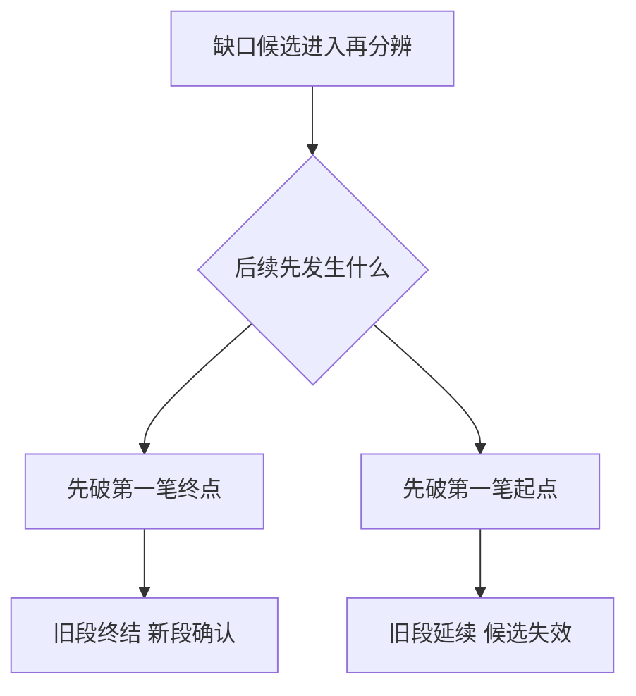
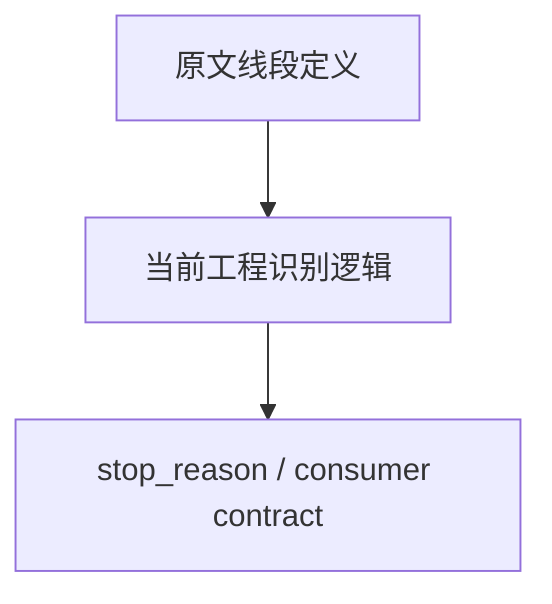

# 线段图文化示例库（V1）

本页提供线段模块的图文化示例模板，服务于人工核图、原文复核和工程行为解释。

使用原则：

- 图示必须同时标清“确认笔序列”“当前线段方向”“终结依据”。
- 任何线段终结示例都应区分“理论定义”和“当前工程 stop_reason”。
- 对 67 课第二种情况、71 课再分辨，必须用时序图而不是只写结论。

## 1. 起段三笔公共重叠示例

场景目标：演示为什么前三笔没有公共重叠就不能起段。

图注模板：

- 必填：三笔区间交集。
- 红线：不能只因“方向交替”就判定起段成立。

## 2. 段内两笔一组扩展示例

场景目标：演示当前实现为什么按“反向一笔 + 同向一笔”扩展。

图注模板：

- 必填：上一同向极值、当前同向极值。
- 说明：这里是当前工程扩展节奏，不是所有原文表述的唯一图法。

## 3. 直接特征序列分型终结示例

场景目标：演示无缺口时的直接终结。

图注模板：

- 必填：是否做过同序列非包含处理。
- 红线：跨特征序列元素不得混入同一次分型判断。

## 4. 67课第二种情况示例

场景目标：演示第一二元素有缺口时不能直接回写终结。

图注模板：

- 必填：第一笔起点、第一笔终点、后续比较顺序。
- 红线：有缺口时不得提前把候选分型写成已确认终点。

## 5. 71课再分辨时序示例

场景目标：演示“先破终点”与“先破起点”决定旧段命运。

图注模板：

- 必填：比较对象的时间先后。
- review 重点：这是一条时序决策链，不是静态三点几何比较。

## 6. 理论/工程/消费三层边界示例

场景目标：演示线段模块里最容易被混写的三层口径。

图注模板：

- 理论层：解释什么叫线段确认。
- 工程层：解释当前代码如何算出线段。
- 消费层：解释下游如何读 `stop_reason`，不能反推理论本体。

## 7. 实盘案例卡片模板

### 7.1 起段卡片

- 标的/级别/时间窗：
- 三笔方向关系：
- 公共重叠区间：
- 是否允许起段：是 | 否

### 7.2 终结卡片

- 标的/级别/时间窗：
- 当前线段方向：
- 终结依据：直接分型 | 缺口再分辨 | 反向破坏
- 对应工程状态：

### 7.3 再分辨卡片

- 标的/级别/时间窗：
- 缺口候选位置：
- 先破终点还是先破起点：
- 结论：旧段终结 | 旧段延续 | 继续等待

## 8. 配套文档跳转

- 文档地图：[segment-doc-map.md](segment-doc-map.md)
- 当前实现主口径：[segment-implementation-guide.md](segment-implementation-guide.md)
- 原文复核矩阵：[segment-original-review-matrix.md](segment-original-review-matrix.md)
- 契约文档：[segment-stop-reason-contract.md](segment-stop-reason-contract.md)
