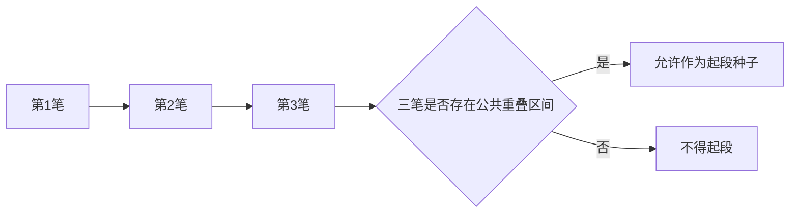
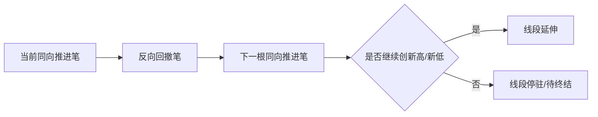
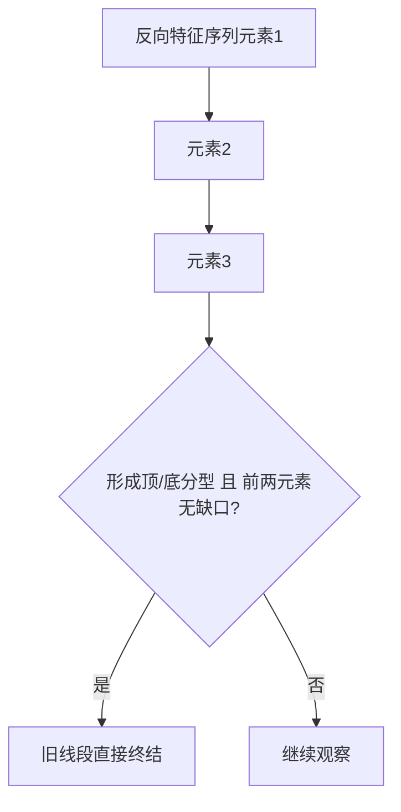
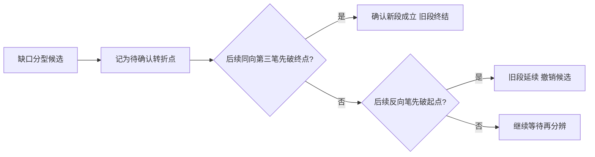
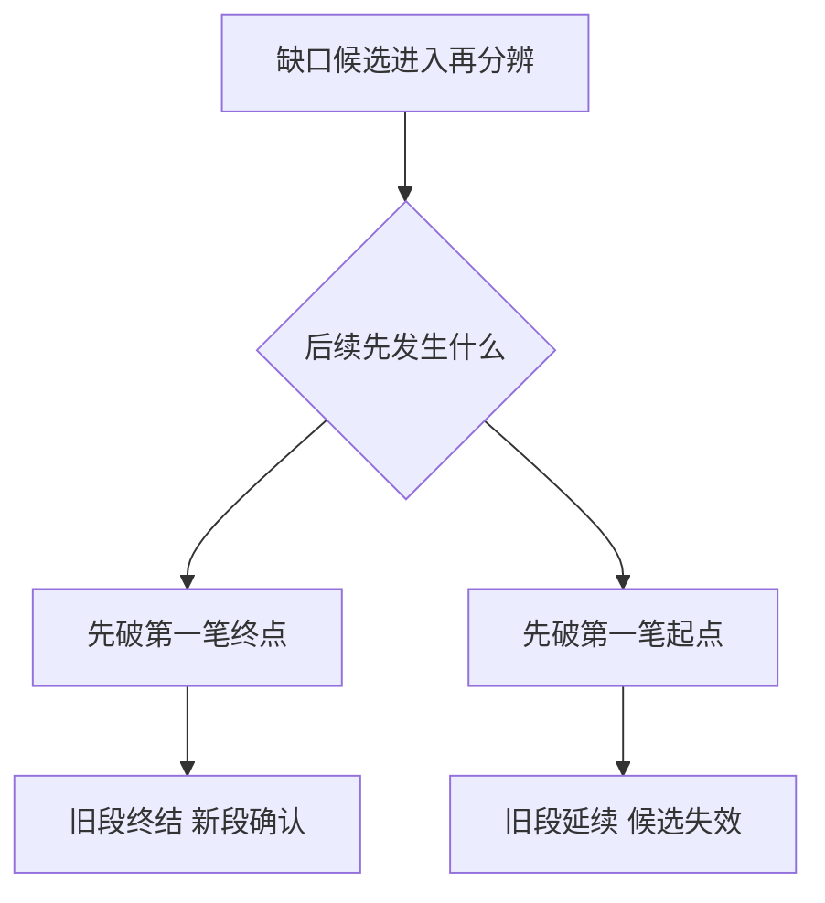
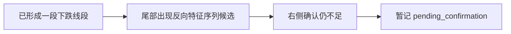
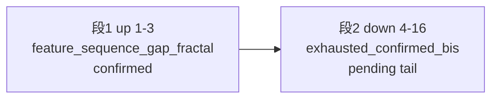
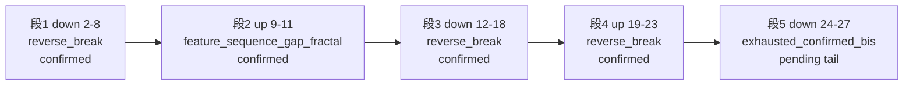
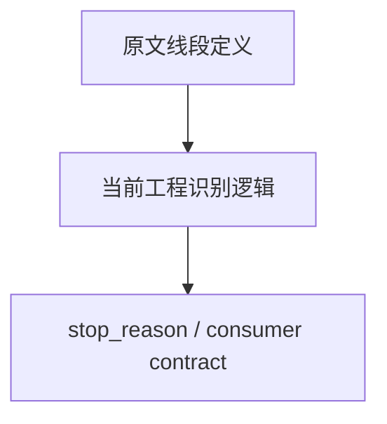

# 线段图文化示例库（V1）

本页提供线段模块的图文化示例模板，服务于人工核图、原文复核和工程行为解释。

使用原则：

- 图示必须同时标清“确认笔序列”“当前线段方向”“终结依据”。
- 任何线段终结示例都应区分“理论定义”和“当前工程 stop_reason”。
- 对 67 课第二种情况、71 课再分辨，必须用时序图而不是只写结论。

## 1. 起段三笔公共重叠示例

场景目标：演示为什么前三笔没有公共重叠就不能起段。

图注模板：

- 必填：三笔区间交集。
- 红线：不能只因“方向交替”就判定起段成立。

## 2. 段内两笔一组扩展示例

场景目标：演示当前实现为什么按“反向一笔 + 同向一笔”扩展。

图注模板：

- 必填：上一同向极值、当前同向极值。
- 说明：这里是当前工程扩展节奏，不是所有原文表述的唯一图法。

## 3. 直接特征序列分型终结示例

场景目标：演示无缺口时的直接终结。

图注模板：

- 必填：是否做过同序列非包含处理。
- 红线：跨特征序列元素不得混入同一次分型判断。

## 4. 67课第二种情况示例

场景目标：演示第一二元素有缺口时不能直接回写终结。

图注模板：

- 必填：第一笔起点、第一笔终点、后续比较顺序。
- 红线：有缺口时不得提前把候选分型写成已确认终点。

## 5. 71课再分辨时序示例

场景目标：演示“先破终点”与“先破起点”决定旧段命运。

图注模板：

- 必填：比较对象的时间先后。
- review 重点：这是一条时序决策链，不是静态三点几何比较。

## 6. `pending_confirmation` vs `confirmed` 对照示例

场景目标：演示“图上看起来快结束”和“结构上已经确认结束”不是一回事，并固定 review 时必须核对的字段与消费红线。

### 6.1 尾部待确认示意

图注模板：

- 结构结论：尾部只能算候选终结，不得提前记为已完成新段。
- review 必填：缺的是哪一侧确认，为什么当前还不能终结旧段。
- 字段核对：`segment_tail_interpretations[*].kind = pending_confirmation`。
- 消费红线：报告、小程序、图表标签都只能写“待确认/观察”，不得压缩成“下跌线段已结束”。

### 6.2 已确认终结示意

图注模板：

- 结构结论：旧段终结已闭合，新的反向线段才允许进入 confirmed。
- review 必填：右侧确认依据、终结时点、旧段终结与新段起段是否同时成立。
- 字段核对：`segment_tail_interpretations` 不应再把同一尾部保留为 `pending_confirmation` 主结论。
- 消费红线：只有在结构确认闭合后，结论和标签才允许升级为“已完成/已确认”。

### 6.3 review 对照卡片模板

| 项目 | 待确认尾部 | 已确认终结 |
| --- | --- | --- |
| 图形直观 | 看起来像结束，但仍可能被右侧改写 | 右侧确认已足以判死旧段 |
| 理论状态 | `pending` | `confirmed` |
| 工程字段 | `segment_tail_interpretations[*].kind=pending_confirmation` | `segment_tail_interpretations[*]` 仅可保留历史说明，主结论应转入 confirmed |
| 报告文案 | 候选完成待确认、继续观察 | 已确认终结、允许进入新段解释 |
| 小程序标签 | `pending/watch` | `confirmed` |
| review 风险 | 视觉先行，结构证据不足 | 用历史 pending 注释干扰当前 confirmed 主结论 |

### 6.4 必查字段清单

review 这组样例时，至少同时核对以下字段或输出：

1. `segment_tail_interpretations`
2. `same_level_decomposition.current_structure_status`
3. `same_level_decomposition_mode`
4. `technical_focus_lines`
5. 图表或导出中的 theory/practical 线段标签

只有当这几层口径同时一致时，才能说“待确认 vs 已确认完成”的消费端没有漂移。

### 6.5 真实案例 A: SZ.000651 30m 尾部待确认

- 标的/级别/时间窗：SZ.000651 / 30m / 2026-04-01 ~ 2026-05-29
- 当前样本来源：`tests/test_build_miniapp_publish_bundle.py` 中的稳定发布样本断言
- 上个已完成走势：上涨 `2026-04-01T10:30:00 -> 2026-05-10T10:30:00`
- 当前进行走势：下跌，自 `2026-05-15T10:30:00` 起，最新 `2026-05-29T10:30:00`
- 当前结构状态：`same_level_decomposition.current_structure_status = candidate_completed_waiting_stability`
- 当前结构标签：`候选完成待确认`
- 尾部解释：`segment_tail_interpretations[-1].kind = pending_confirmation`
- 关键说明：`technical_focus_lines` 明确写出“前段走势已具备完成候选，但边界仍待右侧结构确认稳定。”
- review 结论：这是标准的“视觉上接近终结，但结构上仍待确认”的真实 pending 样本，不得在消费端升级为 confirmed。
- 消费红线：若只读取“最近买点：二买 2026-05-29T10:30:00，价格 10.25”而忽略上述结构字段，就会误把执行层/信号层信息升级成主结构确认。

## 7. 第二种情况 vs 再分辨对照示例

场景目标：把“67课第二种情况的候选终结”与“71课再分辨后的最终判定”拆开，避免把进入再分辨的候选状态误写成最终结论。

### 7.1 第二种情况候选示意

图注模板：

- 结构结论：此时只能说“进入第二种情况候选”，不能直接说旧段已经结束。
- review 必填：元素1/元素2 的缺口位置、候选分型出现时点、为何还不能直接回写终结。
- 字段核对：若当前输出已有候选说明，必须带待确认语义，而不是直接给 confirmed。
- 消费红线：前端和报告不得把“第二种情况候选”压缩成“趋势已反转”或“新段已确认”。

### 7.2 再分辨后确认终结示意

图注模板：

- 结构结论：只有进入再分辨并完成时序判定后，旧段终结才允许升级为 confirmed。
- review 必填：先破终点的证据、触发终结的关键笔、升级为 confirmed 的确切时点。
- 字段核对：`technical_focus_lines` 或等价输出应明确从“候选/待确认”切换为“已确认终结”。
- 消费红线：只有在再分辨完成后，才允许更新主结论、图例颜色和 confirmed 标签。

### 7.3 再分辨后旧段延续示意

图注模板：

- 结构结论：进入再分辨不等于终结概率更高；若先破起点，应撤销候选并恢复旧段延续解释。
- review 必填：先破起点的证据、旧段延续后的边界是否需要右移、历史候选说明如何降级为背景信息。
- 字段核对：原先的候选终结说明不应继续占据主结论位。
- 消费红线：不得保留“已疑似反转”的强结论文案不撤回。

### 7.4 review 对照卡片模板

| 项目 | 第二种情况候选 | 再分辨后确认终结 | 再分辨后旧段延续 |
| --- | --- | --- | --- |
| 理论状态 | `pending` | `confirmed` | `pending_cleared_to_continuation` |
| 关键条件 | 第一二元素有缺口，出现候选分型 | 后续先破第一笔终点 | 后续先破第一笔起点 |
| 主问题 | 不能直接回写终结 | 何时允许升级 confirmed | 何时必须撤销候选 |
| 工程输出 | 候选/待确认说明 | 终结确认说明 | 旧段延续说明 |
| 报告文案 | 进入再分辨、继续观察 | 已确认终结、新段可解释 | 候选失效、旧段延续 |
| review 风险 | 把候选误读为终结 | 把确认时点写早 | 候选撤销不彻底，残留误导文案 |

### 7.5 必查字段清单

review 这组样例时，至少同时核对以下字段或输出：

1. `segment_tail_interpretations`
2. `technical_focus_lines`
3. `same_level_decomposition.current_structure_status`
4. `same_level_decomposition_mode`
5. 图表中第二种情况 / 再分辨对应的 theory/practical 标注

这组样例的核心不是“分型有没有出现”，而是“候选状态何时才能升级为 confirmed，何时又必须回退为旧段延续”。

### 7.6 规范回归案例 C: R6 缺口再分辨延迟确认终结

- 案例类型：规范回归 fixture，不是实盘单股截图。
- 当前样本来源：
  - `tests/segment_lesson_boundary_fixtures.py` 中 `lesson78-gap-delayed-true`
  - `tests/test_segment_rediscrimination_matrix.py` 中 `R6`
- 结构要点：
  - 第一二元素存在缺口，先进入第二种情况候选。
  - 中间先经历一轮“弱同向未突破”，并未立即完成确认。
  - 随后由更晚一轮同向强推进破第一笔终点，旧段终结被延迟确认。
- 理论结果：`stop_reason = feature_sequence_gap_fractal_delayed_true`
- practical 结果：`stop_reason = feature_sequence_gap_fractal_delayed_true`
- confirmed 状态：theory 与 practical 都是 `is_confirmed = true`
- review 结论：这是“第二种情况候选不能立刻下结论，但后续再分辨最终转为 confirmed”的标准正例。
- 消费红线：在进入最终强推进确认前，不得提前把缺口候选解释成已完成终结；只有 `feature_sequence_gap_fractal_delayed_true` 落定后，才允许升级为 confirmed。

### 7.7 规范回归案例 D: 先破第一笔起点，候选撤销并延续旧段

- 案例类型：规范回归 fixture，不是实盘单股截图。
- 当前样本来源：`tests/test_segment_rediscrimination_matrix.py::test_gap_fractal_then_break_first_bi_start_keeps_prior_segment`
- 结构要点：
  - 前面已出现缺口候选，进入再分辨观察窗口。
  - 后续不是先破第一笔终点，而是先破第一笔起点。
  - 因此旧段不应在候选处终结，而应继续延伸。
- 当前结果：
  - 第一段方向仍为 `UP`
  - `end_bi_id = 6`
  - `break_bi_id = 7`
  - `stop_reason = reverse_break`
  - `is_confirmed = true`
- review 结论：这是“第二种情况候选被撤销，最终回到旧段延续路径”的标准反例，不能把它误归为‘缺口分型已确认终结’。
- 消费红线：一旦再分辨先触发“先破起点”，此前的候选终结文案必须降级或撤销，不能继续保留“新段已确认”的任何强提示。

### 7.8 真实回归地标案例 E: SZ.000591 15m 缺口候选与延续并存

- 案例类型：真实回归地标案例，基于 CSV 窗口回归断言，不是已标注的最终截图。
- 当前样本来源：`tests/test_segment_regression_000591.py::test_000591_15m_current_report_window_keeps_continuous_segments`
- 数据窗口：`data/reports/000591/15m/analyze/000591_15m_20260506_to_20260618.csv`
- 当前已锁定事实：
  - 当前连续地标序列为：
    1. `("up", 1, 3, "feature_sequence_gap_fractal", true, (5, 24))`
    2. `("down", 4, 16, "exhausted_confirmed_bis", false, (24, 203))`
  - 这说明该窗口前半段已经出现过一个 confirmed 的缺口分型终结，但后半段并没有继续稳定切出更多已确认线段，而是停在长尾 `exhausted_confirmed_bis`。
  - 因此它天然适合承接“前段 gap turn 已确认，后段仍在延续/待确认”的混合 review 场景。
- 关键笔序时间轴：
  - 第 1 段 `up 1 -> 3`：对应笔 1 到笔 3，时间大致为 `2026-05-07 13:30` 到 `2026-05-13 09:45`，以 `feature_sequence_gap_fractal` confirmed 收束。
  - 第 2 段 `down 4 -> 16`：对应笔 4 到笔 16，时间大致为 `2026-05-13 09:45` 到 `2026-06-11 11:30`，当前只停在 `exhausted_confirmed_bis`，没有继续闭合成新的 confirmed 终结。

图上 review 重点：

- 第 1 段已经给出 confirmed 的 gap turn，因此这个窗口不能被读成“全程都在待确认”。
- 第 2 段又长时间停在 `pending tail`，因此也不能把这个窗口整体压成“缺口分型终结后已经全部完成”。
- 这张图最适合拿来说明“局部 confirmed”与“后续长尾未闭合”如何在同一真实窗口里并存。
- 结构解释：
  - 这个窗口最清楚的点不在“有没有 gap turn”，而在“已确认的 gap turn 后面，为什么会跟着一段长期未闭合的下跌尾部”。
  - 第 1 段说明窗口前半段已经给出一个明确的 confirmed 缺口分型终结。
  - 第 2 段则说明后续右侧结构没有继续切出新的稳定终结，而是一直处于确认笔走完但终结证据不足的长尾状态。
  - 因此它是一个很适合说明“窗口内局部 confirmed 不等于整个窗口都已确认完成”的真实例子。
- review 意义：这个窗口不是“候选与延续并存”的泛泛入口了，而是已经能明确区分出“前段 confirmed gap turn”与“后段未闭合长尾”两层结构状态，适合拿来说明为什么不能把窗口内某个已确认地标外推成整个窗口都已确认。
- 当前使用方式：先把它作为真实数据案例卡的最小版本；后续若补图，重点应标出第 1 段 `feature_sequence_gap_fractal` 之后，为什么第 2 段会长时间停在 `exhausted_confirmed_bis` 而不是继续切出新的 confirmed 终结。
- 消费红线：若只看到第 1 段 `feature_sequence_gap_fractal` 就把整个窗口压成“缺口分型已确认终结”，会忽略第 2 段长尾仍未闭合的事实；反过来若只看到长尾未确认，又会抹掉窗口前半段已经存在的 confirmed gap turn。

### 7.9 真实回归地标案例 F: HK.00700 15m 双 gap turn 回归窗口

- 案例类型：真实回归地标案例，基于 CSV 窗口回归断言，不是已标注的最终截图。
- 当前样本来源：`tests/test_segment_regression_00700.py::test_00700_15m_segments_keep_two_consecutive_gap_fractal_turns`
- 数据窗口：`data/reports/00700/15m/analyze/00700_15m_20260518_to_20260618.csv`
- 当前已锁定事实：
  - 当前连续地标序列为：
    1. `("down", 2, 8, "reverse_break", true, (16, 120))`
    2. `("up", 9, 11, "feature_sequence_gap_fractal", true, (120, 153))`
    3. `("down", 12, 18, "reverse_break", true, (153, 216))`
    4. `("up", 19, 23, "reverse_break", true, (216, 260))`
    5. `("down", 24, 27, "exhausted_confirmed_bis", false, (260, 291))`
  - 这说明同一窗口中不仅出现过 `feature_sequence_gap_fractal` 与 `reverse_break`，而且两者是交错落在连续段链路中的，不是孤立单点。
  - 尾段方向仍为 `down`，最终停在 `exhausted_confirmed_bis`，当前不视为稳定 confirmed 尾部。
- 关键笔序时间轴：
  - 第 1 段 `down 2 -> 8`：对应笔 2 到笔 8，时间大致为 `2026-05-19 10:45` 到 `2026-05-29 16:00`，以 `reverse_break` confirmed 收束。
  - 第 2 段 `up 9 -> 11`：对应笔 9 到笔 11，时间大致为 `2026-05-29 16:00` 到 `2026-06-02 16:00`，这是当前窗口里最明确的 `feature_sequence_gap_fractal` confirmed 段。
  - 第 3 段 `down 12 -> 18`：对应笔 12 到笔 18，时间大致为 `2026-06-02 16:00` 到 `2026-06-09 16:00`，再次以 `reverse_break` confirmed 收束。
  - 第 4 段 `up 19 -> 23`：对应笔 19 到笔 23，时间大致为 `2026-06-09 16:00` 到 `2026-06-15 09:45`，仍为 confirmed 的 `reverse_break` 终结链。
  - 第 5 段 `down 24 -> 27`：对应笔 24 到笔 27，时间大致为 `2026-06-15 09:45` 到 `2026-06-17 11:45`，当前只停在 `exhausted_confirmed_bis`，尚未闭合成新的稳定终结。

图上 review 重点：

- 第 2 段是窗口中最明确的 gap turn confirmed 锚点。
- 第 2 至第 4 段都已 confirmed，但并没有推出“整个窗口最终已完成”。
- 第 5 段重新回到 `pending tail`，因此当前主结构解读必须同时保留“中段已确认”和“最新尾部未闭合”两层信息。
- 结构解释：
  - 第 2 段已经给出一个 confirmed 的 gap turn，因此这个窗口不能被简单理解成“始终都在待确认”。
  - 但第 5 段最终只停在 `exhausted_confirmed_bis`，说明右侧最新尾部又重新回到“确认笔已走完，但缺少足够终结证据”的状态。
  - 因此这个窗口最适合说明“同一真实窗口里，可以同时存在中段 confirmed 转折和最新尾段 pending 尾部”，两者不能相互覆盖。
- review 意义：这是一个很适合补“第二种情况 / 再分辨 / 尾段待确认”混合场景的真实回归窗口，因为同一段数据里已经同时锁定了 gap turn 与 reverse break 地标。
- 当前使用方式：先把它作为后续截图落点和人工核图入口；下一步重点应画清第 2 段 `feature_sequence_gap_fractal` 与第 5 段 `exhausted_confirmed_bis` 之间的结构连接，说明为什么中段已出现缺口分型确认，而尾段仍未闭合。
- 消费红线：若只看到首个或中间某个 `reverse_break` confirmed 地标，就把整个窗口压缩成“已经完全确认结束”，会忽略同窗口中仍存在的 `feature_sequence_gap_fractal` 转折链和最后一段未稳定尾部。

## 8. 重写 / 吸收 / 复用对照示例

场景目标：解释为什么同一段历史图会在后续右侧结构出现后改口，以及这种改口应如何稳定映射到字段、文案和图例，而不是让旧结论和新结论并存冲突。

### 8.1 尾部候选被后续结构推翻示意

图注模板：

- 结构结论：先前的候选终结不是“错数据”，而是被更完整右侧结构改写。
- review 必填：原候选为何成立、后续哪一笔或哪组结构使其失效、重写后的新边界在哪里。
- 字段核对：历史 `pending_confirmation` 说明可以保留为背景，但当前主结论必须切换为新的解释。
- 消费红线：不得同时把旧候选和新主结论都当作当前有效状态。

### 8.2 旧尾部被新结构吸收示意

图注模板：

- 结构结论：吸收强调的是“旧尾部仍是历史事实，但不再是最终边界”。
- review 必填：吸收发生在哪个层级、旧边界为什么不再单独成立、新边界是否进入更大一级结构解释。
- 字段核对：`technical_focus_lines` 或等价说明应明确写出“被后续结构吸收/重写”，而不是只静默替换结果。
- 消费红线：图表和摘要若改口，必须能看出“为什么改口”，不能只剩最终结论。

### 8.3 尾部笔被复用示意

图注模板：

- 结构结论：复用是最容易让下游误解为“前后矛盾”的场景，必须显式说明同一根笔为何换了结构角色。
- review 必填：被复用的是哪根笔、复用前后分别承担什么角色、复用后旧结论如何降级为历史说明。
- 字段核对：若存在 machine-readable 解释，应优先沉淀“复用/重写”原因，而不是只留下终态。
- 消费红线：不得让下游把“同一根笔两次被引用”误解成重复信号或双重确认。

### 8.4 review 对照卡片模板

| 项目 | 候选被推翻 | 尾部被吸收 | 尾部笔被复用 |
| --- | --- | --- | --- |
| 理论状态 | `pending_rewritten` | `boundary_absorbed` | `bi_reused_recomputed` |
| 触发原因 | 右侧结构补全后原候选失效 | 更大结构将旧尾部并入新边界 | 同一根笔改作进入笔/连接笔 |
| 主问题 | 何时必须撤销旧候选 | 何时说明边界右移 | 何时说明角色切换 |
| 工程输出 | 旧候选降级为背景说明 | 当前边界重算说明 | 复用原因与新角色说明 |
| 报告文案 | 原候选已被右侧结构改写 | 原边界被后续结构吸收 | 尾部笔已转作新结构连接 |
| review 风险 | 旧候选残留成现态结论 | 只见新边界，不知为何右移 | 同一笔前后角色切换无解释 |

### 8.5 必查字段清单

review 这组样例时，至少同时核对以下字段或输出：

1. `segment_tail_interpretations`
2. `technical_focus_lines`
3. `same_level_decomposition.current_structure_status`
4. 图表中的 theory/practical 段边界变化
5. 若有中枢联动输出，同时检查相关进入笔/离开笔说明是否跟着更新

这组样例的核心不是“为什么现在结论变了”这句抱怨本身，而是“结论变动是否有稳定、可追溯、可消费的结构解释”。

### 8.6 真实案例 B: SZ.000651 30m 中枢吸收导致线段解释重写

- 标的/级别/时间窗：SZ.000651 / 30m / 2026-05-15 ~ 2026-05-29
- 当前样本来源：`tests/test_build_miniapp_publish_bundle.py` 中的稳定发布样本断言
- 当前结构状态：`candidate_completed_waiting_stability`
- 重写证据：`technical_focus_lines` 明确写出“前一中枢 ZS2 的走出笔 29 被当前中枢 ZS3 复用为进入笔 29，当前按更大级别扩展吸收处理。”
- debug 侧证据：
  - `same_level_decomposition.debug_context.auto_reabsorption_detected = true`
  - `same_level_decomposition.debug_context.latest_zhongshu.zs_id = 3`
  - `same_level_decomposition.debug_context.reabsorbed_predecessor.zs_id = 2`
  - `same_level_decomposition.debug_context.reabsorbed_predecessor.superseded_by_zs_id = 3`

图上 review 重点：

- 旧解释的问题不在“笔 29 不存在”，而在它的结构角色后来被改写了。
- 同一根笔 29 从 `ZS2` 的走出笔，变成 `ZS3` 的进入笔，这是典型的“复用导致边界重算”。
- 一旦发生这种复用，消费端必须保留“为什么改口”的说明，而不是只保留最终边界。
- review 结论：这不是简单的“旧结论算错了”，而是右侧结构继续展开后，旧走出笔被新中枢复用，导致原边界解释被更大结构吸收重写。
- 消费红线：图表、报告、小程序若只显示最新边界而不保留“复用/吸收”说明，用户会把前后两次解释看成互相矛盾，而不是结构递进。

### 8.7 规范联动案例 G: 中枢结构文本层已锁定同类重写说明

- 案例类型：规范联动 fixture，不是实盘单股截图。
- 当前样本来源：`tests/test_zhongshu_structure_text.py::test_analyze_current_state_includes_reabsorption_debug_text`
- 当前已锁定事实：
  - `previous_zs` 带有 `superseded_by_zs_id = 3` 与 `is_reabsorbed_by_larger_expansion = true`
  - `current_zs` 使用同一根进入笔 `29`
  - 文本层断言已固定：
    `重写说明：前一中枢 ZS2 虽已走出，但其走出笔 29 被当前中枢 ZS3 复用为进入笔 29，当前按更大级别扩展吸收处理。`
- review 意义：这说明“复用/吸收导致旧解释被重写”并不是只在发布层 payload 里偶然出现，而是已经被中枢结构文本层作为稳定解释口径锁住。
- 消费红线：如果某个下游只保留最终边界，不保留这条重写说明，就会和当前已测试锁定的文本主口径发生偏离。

## 9. 理论/工程/消费三层边界示例

场景目标：演示线段模块里最容易被混写的三层口径。

图注模板：

- 理论层：解释什么叫线段确认。
- 工程层：解释当前代码如何算出线段。
- 消费层：解释下游如何读 `stop_reason`，不能反推理论本体。

## 10. 实盘案例卡片模板

### 10.1 起段卡片

- 标的/级别/时间窗：
- 三笔方向关系：
- 公共重叠区间：
- 是否允许起段：是 | 否

### 10.2 终结卡片

- 标的/级别/时间窗：
- 当前线段方向：
- 终结依据：直接分型 | 缺口再分辨 | 反向破坏
- 当前确认状态：pending_confirmation | confirmed
- 对应工程状态：

### 10.3 再分辨卡片

- 标的/级别/时间窗：
- 缺口候选位置：
- 当前阶段：第二种情况候选 | 再分辨确认终结 | 再分辨撤销候选
- 先破终点还是先破起点：
- 结论：旧段终结 | 旧段延续 | 继续等待

### 10.4 待确认 vs 已确认对照卡片

- 标的/级别/时间窗：
- 当前线段方向：
- 视觉上为何像终结：
- 当前仍未闭合的确认条件：
- 当前字段状态：
- 报告/小程序允许文案：
- 最终何时才能从 `pending_confirmation` 升级到 `confirmed`：

### 10.5 第二种情况 vs 再分辨对照卡片

- 标的/级别/时间窗：
- 第一二元素缺口位置：
- 候选分型出现时点：
- 当前所处阶段：第二种情况候选 | 再分辨中 | 已确认终结 | 已撤销候选
- 先破终点还是先破起点：
- 当前字段状态：
- 报告/小程序允许文案：
- 最终结论：旧段终结 | 旧段延续 | 继续等待

### 10.6 重写 / 吸收 / 复用对照卡片

- 标的/级别/时间窗：
- 被改写的原结论：
- 触发改写的右侧结构：
- 当前属于：候选被推翻 | 尾部被吸收 | 尾部笔被复用
- 新旧边界差异：
- 当前字段状态：
- 报告/小程序允许文案：
- 是否需要同步修正中枢或走势类型解释：是 | 否

## 11. 配套文档跳转

- 文档地图：[segment-doc-map.md](segment-doc-map.md)
- 当前实现主口径：[segment-implementation-guide.md](segment-implementation-guide.md)
- 原文复核矩阵：[segment-original-review-matrix.md](segment-original-review-matrix.md)
- 契约文档：[segment-stop-reason-contract.md](segment-stop-reason-contract.md)
