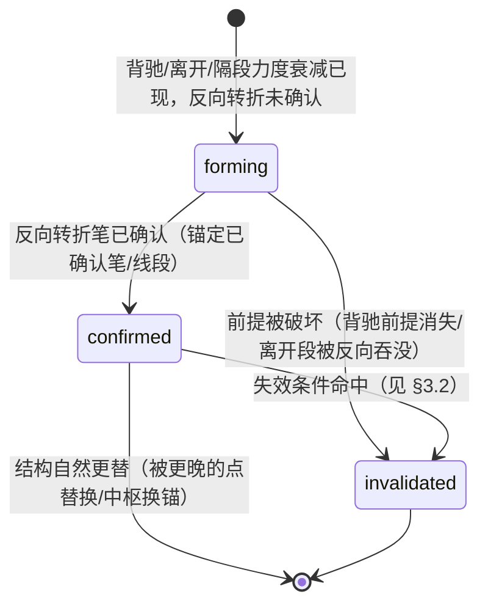

# 买卖点实时化与信号生命周期设计

> 本文属设计层（回答「工程如何把规格落地为状态机 / 协议」），对应任务层
> [buy-sell-multi-level-tasks.md](buy-sell-multi-level-tasks.md) 的 RS0-RS5，理论口径以
> [buy-sell-multi-level-spec.md](buy-sell-multi-level-spec.md) §2.8 为准。
> 覆盖标准一 / 二 / 三类点与类一（LB1 / LS1）/ 类二（LB2 / LS2）类点。
> 交付分批推进，各批状态见任务层看板。

## 1. 问题陈述

当前 `analyze_chanlun_signals`（`src/chanlun/analysis.py`）在准确性与实时性上有两条主缺口：

1. **无信号生命周期**：买卖点只有「不发 / 确认发」两态。一个点写入报告后，直到下一次全量重算前
   不会被撤销——即使价格随后创新低 / 新高破坏其前提。缺「确认 → 失效」回路，也缺「同一确认信号
   跨帧不得消失 / 翻转」的 repaint 护栏。
2. **实时预警缺席**：信号必须等「已确认笔 + 反向转折」才发，盘中用户常错过窗口。现有
   `zs_monitor_alert`（pre_breakout / pre_breakdown）只针对中枢突破，未泛化到每类买卖点的
   「背驰已现、待转折确认」预备态。

多级别联立目前是单向（上级别 pending/auxiliary → 下级别降 watch），缺下级别 → 上级别的升级确认。

## 2. 设计目标

- 为每个买卖点引入统一状态机，`confirmed` 严格锚定已确认笔 / 线段，跨帧单调、不 repaint。
- 在 `confirmed` 之前给出可操作的 `forming` 预备态（watch 档），盘中更早预警。
- 补多级别双向联立：小转大候选在必要条件 + 高级别闭环时自动升级。
- 所有新增语义先落契约字段 + 回归护栏，再接消费端。

## 3. 信号生命周期状态机（RS0）

### 3.1 状态定义

| 状态 | 语义 | 消费档 | 锚定要求 |
| --- | --- | --- | --- |
| `forming` | 预备态：核心背驰 / 离开条件成立，待反向转折确认 | watch（不得升 confirmed） | 可锚定进行中笔 |
| `confirmed` | 确认态：反向转折已确认 | actionable（受多级别降级约束） | 必须锚定已确认笔 / 线段 |
| `invalidated` | 失效态：确认后前提被破坏 | 不操作 / 撤单提示 | 保留原 `signal_bi_id` + `invalidated_reason` |

### 3.2 各点类型失效条件（应然候选，待评审）

| 点类型 | `confirmed → invalidated` 触发 |
| --- | --- |
| 一买 / 一卖 | 离开段极值被后续有效跌破 / 升破（背驰构成的转折被否定） |
| 二买 / 二卖 | 回抽 / 反抽破前低 / 前高（首次确认性回抽失败） |
| 三买 / 三卖 | 首次回试 / 反抽重新跌回 / 站回中枢（离开中枢的「不回归」前提被破坏） |
| 类一买 / 类一卖（LB1 / LS1） | 盘整背驰前提消失（离开段 vs 进入段力度关系反转）或 range 门控退出 |
| 类二买 / 类二卖（LB2 / LS2） | 隔段背驰前提消失（A_{i+2} 力度不再弱于 A_i）或同级别分解退出 single_confirmed |

### 3.3 Repaint 安全红线

- `confirmed` 仅锚定 `is_confirmed=True` 的笔 / 线段；未确认笔只能承载 `forming`。
- 同一 `signal_bi_id` 的 `confirmed` 在后续帧只能保持或转 `invalidated`，禁止消失 / 反向。
- 回归护栏：bar-by-bar replay 真实样本（1m/5m/30m/day），断言 confirmed 集合单调。

#### 3.3.1 2026-09-12 核对结果（红线 1 曾被违反；红线 2 尚有存量）

关于红线 1（`confirmed` 仅锚定已确认笔）——**曾被真实违反，已修**：

- 症状：21 个冻结真实窗口逐 cutoff 回放时，`000591 day` cutoff=1010 的 `buy1` 以
  `lifecycle_state=confirmed` 锚在 **未确认的 pending 尾笔** bi=95 上（同期 `exit_segment.end_bi_id=77`
  才是门控校验过、且 `is_confirmed=True` 的笔）。
- 根因：一类点发点门控用的是「离开段末笔」（`buy_signal_bi` / `sell_signal_bi`），
  但 `build_signal_point_payloads` 里 `buy_1` / `buy_2` / `sell_2` **没有专用锚点参数**，
  落到 `latest_down` / `latest_up`；后者可能正是未确认尾笔，再被「active 即 confirmed」的兜底盖成确认态。
  （`sell_1` 因为落到 `latest_confirmed_up` 而「偶然安全」，属买/卖不对称。）
- 修复：补 `buy1_signal_bi` / `buy2_signal_bi` / `sell1_signal_bi` / `sell2_signal_bi` 专用锚点参数，
  由调用方传入门控校验过的那根笔；同时让生命周期兜底 **fail closed**——锚点未确认只能给 `forming`。
- 护栏：新增 `tests/test_signal_lifecycle_anchor_gate.py`（冻结 fixture 跨帧回放，24 项），
  并注册进 `scripts/run_segment_safety_gates.py` 的 `signal-lifecycle` 闸门。
  原闸门 `tests/test_signal_repaint_gate.py` 依赖 gitignored 的 `data/reports/**`、
  缺失时 `pytest.skip`，在干净检出 / CI 中并不执行，因此该违约可长期潜伏。

关于红线 2（confirmed 不得消失 / 翻转）——**存量未清零，待收口**：

- 同一回放口径下仍有 **32 条** `vanished_without_break`。其中 **19 条**属设计文档
  §3 状态机里已允许的终态「`confirmed --> [*]`：结构自然更替（被更晚的点替换 / 中枢换锚）」，
  但 `replay_confirmed_signal_lifecycle` 只建模了 `invalidated` / `rebased` / `repaint_violation`
  三态，没有 `superseded`，于是把「被更晚同类点更替」误报成 repaint 违规。
  例如 `000591 5m`：frame 9 的 `sell3@bi45/4.34` 在 frame 10 被 `sell3@bi49/4.35` 更替。
- 剩余 13 条既非 `superseded` 也无法由 `_signal_premise_broken` 解释，需个案定性
  （可能是「同类点换了点类型」或「前提破坏模型覆盖不足」）。
- 收口前不宜放宽判定：应先为 `superseded` 建显式分支（单独成列、可审计），
  再逐条消化剩下 13 条，不得直接改成「消失即豁免」。
- 回放探针：`build/probe_signal_lifecycle_replay.py`（固定窗口起点，使 `data_window` 恒定，
  避免被「窗口重基」豁免路径掩盖）。

### 3.4 invalidation 与 repaint 的跨帧实现（RS0 增量2）

invalidation 是跨帧概念：单帧 `analyze_chanlun_signals` 恒按最新结构判定，前提被破坏时确认点自然
不再发射，故失效态无法从单帧稳定推出。落地为 `replay_confirmed_signal_lifecycle(frames)`：

- 输入：按时间序的多帧 `analyze_chanlun_signals` 输出。
- 逐帧比较 confirmed 集合（键 = `point` + `signal_bi_id`）：某锚点从 confirmed 消失时，若该帧成立
  前提已破坏（`_signal_premise_broken`，按 §3.2 分族）→ 记 `invalidated` + `invalidated_reason`；
  否则记 `repaint_violations`（违反上面的 repaint 红线）。
- 输出：`{timeline, invalidated, repaint_violations}`，既是失效发射，也是 repaint 自动护栏。

## 4. 实时预备态（RS1）

- 复用现有背驰量（`segment_bottom/top_divergence`、隔段 / 盘整背驰）与离开 / 回试判定，当
  「背驰 / 离开成立但 `_has_reverse_turn_after` 尚未成立」时，产出 `forming` 而非静默丢弃。
- 与 `zs_monitor_alert` 关系：`zs_monitor_alert` 是中枢突破层预警，`forming` 是买卖点层预备态；
  二者可并存但不得互相顶替。
- 消费：`forming` 一律 watch 档，文案显式「待转折确认，非确认点」。

### 4.1 2026-09-12 核对：forming 在真实链路上不可达（需设计决策）

现状是「链路完备、产不出数据」：

- 小程序「买卖点」页已能渲染 `forming`（`publishViewService.js:621-622` / `682-683` 为买卖两侧成行，
  `SIGNAL_LIFECYCLE_LABELS.forming = '预备'`，`buyPoints/index.wxml` 渲染 `lifecycle-badge`）；
  发布包也会输出「买卖点预备：…（待转折确认，非确认点）」文案行。
- 但真实数据恒为空：287 帧冻结真实窗口 `forming_points` 出现 **0 次**；
  本地 96 个真实 `tech.json` 中 64 个带该字段、**非空 0 个**。

归因（合取项真实命中，见 `tests/test_signal_forming_reachability.py`）：

| 合取项 | 命中 |
| --- | --- |
| `seg_pair_present`（当前中枢同时解析出 entering 与 exit 段） | **30 / 203** ← 主阻塞 |
| `tail_ok`（尾部同向笔在 zs 边界外且无反向转折） | 129 |
| `segment_bottom_divergence=True` | 14 |
| `tail_ok ∧ ongoing_down ∧ bottom_div=True` | 3（但这些帧 `buy_1` 已 confirmed，forming 按设计跳过） |

根因：**背驰只在「已终结、有离开段」的中枢上可算**（ongoing 中枢的 `exit_bi_id` 为 None，
故 173/203 帧根本不计算 `segment_bottom_divergence`），而**「待转折确认」只存在于未终结的
最新中枢**。两个前提构造上互斥。

同源的另一个隐蔽点：原 forming 的「待转折确认」判在**已完成的离开段末笔**上，而笔严格交替且
该笔之后必然还有已确认后续笔 → `_has_reverse_turn_after` 恒为 True（实测 42/42），
即该子条件在真实链路上逻辑上不可满足。已改为判在**实时尾部**（`latest_down` / `latest_up`），
并保持 forming-only（不影响任何 confirmed 发点）。

尚未解决：即使去掉上述子条件，合取仍不相交（见上表）。两条可选方向：

1. **重定形成前提**：让 forming 挂到「未终结中枢的离开尝试」上（如尾部笔相对 ZG/ZD 的突破未回），
   而不是复用「已终结中枢的段级背驰」。
2. **承认不可达并下架**：删除 `forming_points` 及其发布/前端链路，把 RS1 标为不做，
   避免维护一个永远为空的字段与 UI 分支。

在此之前保持 strict xfail：不得用「改成宽条件」把红灯刷绿。

## 5. 多级别双向联立（RS2）

- 现状单向：`build_lower_timeframe_precision_entry` 依上级别 `same_level_consumption_level` 降级。
- 补升级方向（已落地）：当 `small_to_large_status == 必要条件已具备`（最后一个次级别中枢出现对应三类点）
  且高级别结构闭环时，把高级别「小转大候选」升级为「已确认转折」；未闭环只标候选。
- 红线（第 35 / 43 / 44 课）：必要 ≠ 充分；低级别信号不得单独推翻高级别未完成结构。

实现落点（`src/chanlun/analysis.py`）：

- `_higher_level_structure_closed(higher_signals, side)`：高级别结构闭环 = `current_structure_status ==
  completed_then_new_type` + `same_level_consumption_level == confirmed` + 新走势方向与 `side` 一致
  （buy→up / sell→down）。三者缺一不升级，兜住「必要 ≠ 充分」与「不得推翻未完成结构」两条红线。
- `_build_small_to_large_status`：候选 → 必要条件已具备（`third_class_confirmed`）→ 结构闭环后
  升级为 `higher_level_confirmed`（契约新增枚举，label「小转大已确认转折」）。
- 区间套反向确认：`_build_small_to_large_reverse_confirm` 仅在升级为 `higher_level_confirmed` 时回填
  `small_to_large_reverse_confirm = {active, basis=lower_third_class_and_higher_structure_closed,
  higher_structure_status, note}`，并把 note 追加进精确入场 `note`，表达「次级别三类点 + 高级别闭环」
  的双向确认链。
- 回归：`tests/test_chanlun_analysis.py`（buy/sell 升级正例 + 结构未闭环反例）、
  `tests/test_analysis_contract.py`（新增枚举完整性与 label/note）。

## 6. 契约字段草案（待评审）

> 落 `src/chanlun/analysis_contract.py` + Markdown 契约页，遵循 spec-change-protocol 契约同步规则。

| 字段 | 值域 | 归属 |
| --- | --- | --- |
| `lifecycle_state` | `forming | confirmed | invalidated` | 每个买卖点 payload |
| `invalidated_reason` | 枚举（见 §3.2）/ null | 仅 `invalidated` 时非空 |
| `forming_basis` | 复用现有 `SignalBasis` + 预备态标记 | 仅 `forming` 时 |

消费降级：新消费者优先读 `lifecycle_state`；`forming` → watch，`invalidated` → 不操作，
`confirmed` 才允许按现有 `same_level_consumption_level` 档位输出。

## 6.1 消费交付链（RS5）

买卖点的主要展示面是小程序「买卖点」页面，改动必须穿透两层才可见：

1. **发布包透传层**（`scripts/build_miniapp_publish_bundle.py`）：`normalize_signal_point` 现只透出
   `point/label/time/price/active/basis`，需增补 `lifecycle_state` / `invalidated_reason` / `forming`；
   `forming` 点不能被 `active` 过滤丢弃（`build_latest_signal_summary`）。
2. **前端渲染层**（`c:/sandbox/sinba/westock/`，独立仓库）：「买卖点」页面按 `lifecycle_state`
   渲染 `forming`（预备 / 观察角标）、`confirmed`（正常）、`invalidated`（已失效 + 原因）。

渐进策略：初期可复用现有 `zs_monitor_alert` 文本行（页面已展示「中枢预警：…」），先以文本行
透出买卖点预备态，再逐步升级为结构化 `lifecycle_state` 角标。红线：`forming` 不得在页面上
渲染成确认买卖点。

## 7. 实现顺序（评审通过后）

1. RS0 契约 + 状态机 + repaint 回归护栏（横切前置）。
2. RS1 预备态（复用 RS0 状态机）。
3. RS5 消费交付：发布包透传 + 小程序「买卖点」页面渲染（随 RS0/RS1，确保用户可见）。
4. RS2 多级别升级方向（已落地：小转大自动升级 + 区间套反向确认）。
5. RS3 收口工程近似（与 RS0 失效条件联动）。
6. RS4 增量重算稳健性（数据层，独立可并行）。

## 8. 关联

- 规格层：[buy-sell-multi-level-spec.md](buy-sell-multi-level-spec.md)
- 任务层：[buy-sell-multi-level-tasks.md](buy-sell-multi-level-tasks.md)（RS0-RS4）
- 差异矩阵：[theory-implementation-consumer-diff-matrix.md](theory-implementation-consumer-diff-matrix.md)
- 变更协议：[spec-change-protocol.md](spec-change-protocol.md)
