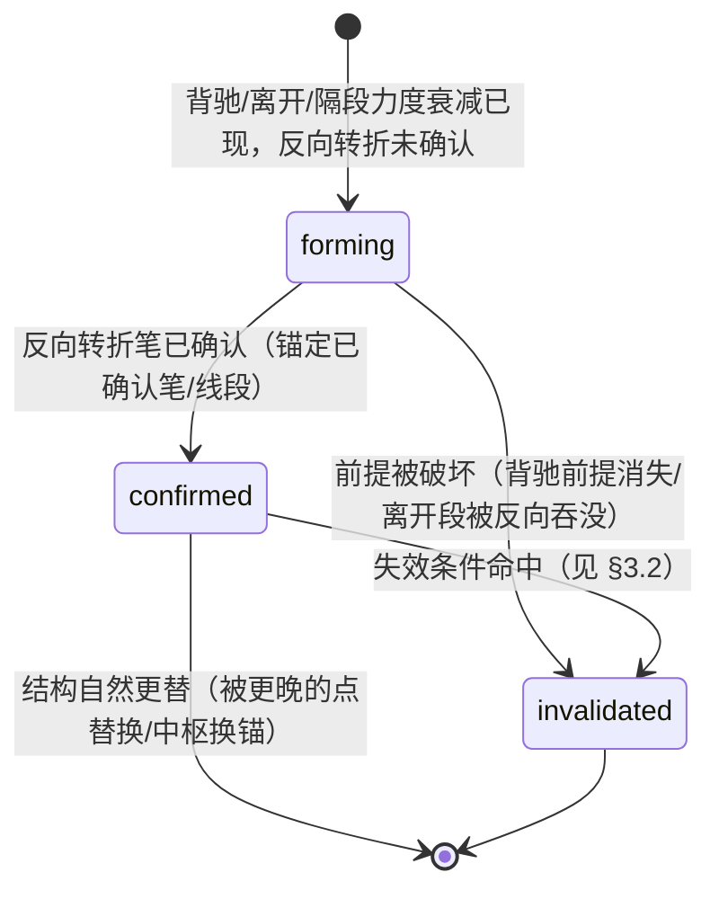

# 买卖点实时化与信号生命周期设计

> 本文属设计层（回答「工程如何把规格落地为状态机 / 协议」），对应任务层
> [buy-sell-multi-level-tasks.md](buy-sell-multi-level-tasks.md) 的 RS0-RS5，理论口径以
> [buy-sell-multi-level-spec.md](buy-sell-multi-level-spec.md) §2.8 为准。
> 覆盖标准一 / 二 / 三类点与类一（LB1 / LS1）/ 类二（LB2 / LS2）类点。
> 交付分批推进，各批状态见任务层看板。

## 1. 问题陈述

当前 `analyze_chanlun_signals`（`src/chanlun/analysis.py`）在准确性与实时性上有两条主缺口：

1. **无信号生命周期**：买卖点只有「不发 / 确认发」两态。一个点写入报告后，直到下一次全量重算前
   不会被撤销——即使价格随后创新低 / 新高破坏其前提。缺「确认 → 失效」回路，也缺「同一确认信号
   跨帧不得消失 / 翻转」的 repaint 护栏。
2. **实时预警缺席**：信号必须等「已确认笔 + 反向转折」才发，盘中用户常错过窗口。现有
   `zs_monitor_alert`（pre_breakout / pre_breakdown）只针对中枢突破，未泛化到每类买卖点的
   「背驰已现、待转折确认」预备态。

多级别联立目前是单向（上级别 pending/auxiliary → 下级别降 watch），缺下级别 → 上级别的升级确认。

## 2. 设计目标

- 为每个买卖点引入统一状态机，`confirmed` 严格锚定已确认笔 / 线段，跨帧单调、不 repaint。
- 在 `confirmed` 之前给出可操作的 `forming` 预备态（watch 档），盘中更早预警。
- 补多级别双向联立：小转大候选在必要条件 + 高级别闭环时自动升级。
- 所有新增语义先落契约字段 + 回归护栏，再接消费端。

## 3. 信号生命周期状态机（RS0）



### 3.1 状态定义

| 状态 | 语义 | 消费档 | 锚定要求 |
| --- | --- | --- | --- |
| `forming` | 预备态：核心背驰 / 离开条件成立，待反向转折确认 | watch（不得升 confirmed） | 可锚定进行中笔 |
| `confirmed` | 确认态：反向转折已确认 | actionable（受多级别降级约束） | 必须锚定已确认笔 / 线段 |
| `invalidated` | 失效态：确认后前提被破坏 | 不操作 / 撤单提示 | 保留原 `signal_bi_id` + `invalidated_reason` |

### 3.2 各点类型失效条件（应然候选，待评审）

| 点类型 | `confirmed → invalidated` 触发 |
| --- | --- |
| 一买 / 一卖 | 离开段极值被后续有效跌破 / 升破（背驰构成的转折被否定） |
| 二买 / 二卖 | 回抽 / 反抽破前低 / 前高（首次确认性回抽失败） |
| 三买 / 三卖 | 首次回试 / 反抽重新跌回 / 站回中枢（离开中枢的「不回归」前提被破坏） |
| 类一买 / 类一卖（LB1 / LS1） | 盘整背驰前提消失（离开段 vs 进入段力度关系反转）或 range 门控退出 |
| 类二买 / 类二卖（LB2 / LS2） | 隔段背驰前提消失（A_{i+2} 力度不再弱于 A_i）或同级别分解退出 single_confirmed |

### 3.3 Repaint 安全红线

- `confirmed` 仅锚定 `is_confirmed=True` 的笔 / 线段；未确认笔只能承载 `forming`。
- 同一 `signal_bi_id` 的 `confirmed` 在后续帧只能保持或转 `invalidated`，禁止消失 / 反向。
- 回归护栏：bar-by-bar replay 真实样本（1m/5m/30m/day），断言 confirmed 集合单调。

#### 3.3.1 2026-09-12 核对结果（红线 1 曾被违反；红线 2 尚有存量）

关于红线 1（`confirmed` 仅锚定已确认笔）——**曾被真实违反，已修**：

- 症状：21 个冻结真实窗口逐 cutoff 回放时，`000591 day` cutoff=1010 的 `buy1` 以
  `lifecycle_state=confirmed` 锚在 **未确认的 pending 尾笔** bi=95 上（同期 `exit_segment.end_bi_id=77`
  才是门控校验过、且 `is_confirmed=True` 的笔）。
- 根因：一类点发点门控用的是「离开段末笔」（`buy_signal_bi` / `sell_signal_bi`），
  但 `build_signal_point_payloads` 里 `buy_1` / `buy_2` / `sell_2` **没有专用锚点参数**，
  落到 `latest_down` / `latest_up`；后者可能正是未确认尾笔，再被「active 即 confirmed」的兜底盖成确认态。
  （`sell_1` 因为落到 `latest_confirmed_up` 而「偶然安全」，属买/卖不对称。）
- 修复：补 `buy1_signal_bi` / `buy2_signal_bi` / `sell1_signal_bi` / `sell2_signal_bi` 专用锚点参数，
  由调用方传入门控校验过的那根笔；同时让生命周期兜底 **fail closed**——锚点未确认只能给 `forming`。
- 护栏：新增 `tests/test_signal_lifecycle_anchor_gate.py`（冻结 fixture 跨帧回放，24 项），
  并注册进 `scripts/run_segment_safety_gates.py` 的 `signal-lifecycle` 闸门。
  原闸门 `tests/test_signal_repaint_gate.py` 依赖 gitignored 的 `data/reports/**`、
  缺失时 `pytest.skip`，在干净检出 / CI 中并不执行，因此该违约可长期潜伏。

关于红线 2（confirmed 不得消失 / 翻转）——**已收口（2026-09-12）**：

- 同一回放口径（21 个冻结窗口 × 12 cutoff）下原有 **32 条** `vanished_without_break`。
- 已为 `superseded` 建**显式、可审计**分支（见 §3.5），按「独立于本次消失」的结构推进证据分流：
  `reanchored` 16 + `zs_superseded` 7 + `sibling_new_anchor` 5 = **28 条**，均属设计文档 §3
  明文允许的终态「`confirmed --> [*]`：结构自然更替（被更晚的点替换 / 中枢换锚）」。
- 余 **2 条无任何独立证据**，为本轮唯一存量：`00700 day f10 buy3@77`、`03690 5m f9 sell2like@77`；
  已定性为真缺陷（§4.2.8）并**已修复** → 改判 `invalidated`（结构型前提失效，§3.6），
  使 `vanished_without_break` **2 → 0**。
- 另有 `reconfirm_after_invalidated`：去重后为**真实 1 起事件**（曾因按帧重复计数报为 2 条），
  根因是**参考中枢 `zs_id` 回退**（属更上层不稳定，非生命周期层），见 §4.2.9 —— **保留不豁免**。
- 回放探针（均不提交）：`build/probe_signal_lifecycle_replay.py`（固定窗口起点，使 `data_window`
  恒定，避免被「窗口重基」豁免路径掩盖）、`build/probe_repaint_cases_detail.py`、
  `build/probe_supersede_criteria.py`、`build/probe_supersede_outcome.py`。

### 3.4 invalidation 与 repaint 的跨帧实现（RS0 增量2）

invalidation 是跨帧概念：单帧 `analyze_chanlun_signals` 恒按最新结构判定，前提被破坏时确认点自然
不再发射，故失效态无法从单帧稳定推出。落地为 `replay_confirmed_signal_lifecycle(frames)`：

- 输入：按时间序的多帧 `analyze_chanlun_signals` 输出。
- 逐帧比较 confirmed 集合（键 = `point` + `signal_bi_id`）：某锚点从 confirmed 消失时，若该帧成立
  前提已破坏（`_signal_premise_broken`，按 §3.2 分族）→ 记 `invalidated` + `invalidated_reason`；
  否则记 `repaint_violations`（违反上面的 repaint 红线）。
- 输出：`{timeline, invalidated, repaint_violations, rebased, superseded}`，既是失效发射，也是 repaint 自动护栏。

### 3.5 `superseded` 自然更替分支（RS0 增量5，2026-09-12）

改动前的回放只建模 `invalidated` / `rebased` / `repaint_violation`，把「结构推进导致的旧点终止」
一律报成违规（实测 28/30 属误报）。现补入显式终态分支，判定优先级：

```
invalidated（前提被破坏） → rebased（窗口重基） → superseded（结构自然更替） → repaint_violation
```

**证据（`analysis.classify_confirmed_disappearance`，必须独立于本次消失、可审计）：**

| 证据键 | 含义 | 本轮命中 |
| --- | --- | --- |
| `reanchored` | 同一 `point` 仍 confirmed，但锚点已换（设计 §3「被更晚的点替换」） | 16 |
| `zs_superseded` | 中枢链结构发生变化（`zs_id` 变化；`zs_id` 是**扫描序号**，见 §4.2.10） | 7 |
| `sibling_new_anchor` | **其他** `point` 新增确认锚点（新结构产出新点） | 5 |
| 无证据 | → 仍判 `repaint_violation`（**fail closed**） | 2 |

**三个必须守住的点（本轮踩过的坑）：**

1. **不得把本点自己的位置型门控变化（`hold_s3` / `ls2_anchor` 等）算作证据**。
   它们**就是**该点自己的发点锚点，「门控变化」与「点消失」是同一件事，属**同义反复**；
   用它归类会得出「0 条未能归因」的**假结论**（本文件 §4.2.5 已更正）。
2. **不得退化为「消失即豁免」**。实现上用「无证据 → 违规」的 fail closed，并已有单测
   `test_replay_still_flags_repaint_without_independent_evidence` 钉住；
   否则闸门在真实数据上永不触发（空转闸门反模式）。
3. **旧帧兼容必须 fail closed**。`to_lifecycle_frame` 新增持久化 `zs_id`；仍缺
   `zs_id` 且无 `current_zs` 的旧压缩帧**不得据此豁免**（`test_replay_does_not_exempt_legacy_frame_missing_zs_id`）。

**非空转证据**：`zs_id` 在 209/266 个相邻帧对中不变、`point_anchors` 在 169/266 中不变、
8 个帧对完全冻结 —— 即豁免条件并不恒成立，闸门仍会触发（本轮仍有 2 条）。

`derive_signal_lifecycle_transitions` 透出 `superseded_points`（附 `superseded_evidence`），
summary 侧新增 `lifecycle_superseded_points`（additive）。

### 3.6 结构型前提失效（RS0 增量6，2026-09-12）

§3.5 的 `superseded` 解决「结构推进导致的自然更替」；但类二 / 三类点还有一类消失是
**结构型前提不再成立** —— 点**应当**消失，只是不该被报成 repaint：

- 类二（`buy2like` / `sell2like`）：隔段背驰锚点（`lb2_anchor` / `ls2_anchor`）必须仍存在；
  同级别分解退出 `single_confirmed` 时锚点即为 `None`（与既有 reason 文案
  「隔段背驰前提消失**或同级别分解退出 single_confirmed**」一致）。
- 三类（`buy3` / `sell3`）：回试 / 反抽段（`hold_b3` / `hold_s3`）必须仍存在。

实现：`analysis._structural_premise_broken(point, frame)`，依据 `analyze_chanlun_signals`
新增透出的 `signal_gate_anchors`（`buy3_hold` / `sell3_hold` / `buy2like_anchor` /
`sell2like_anchor`；**存在即非 None，与是否已发点无关**），并随 `to_lifecycle_frame` 持久化。

判定优先级（新分支插在**更替之后、违规之前**）：

```
price premise → rebased → superseded → structural premise → repaint_violation
```

**为何必须放在 supersede 之后**：有更替证据时应判更替。反过来会把那 28 条自然更替错报成失效
（方向相反的错误）。已由 `test_replay_prefers_superseded_over_structural_invalidated` 钉住。

**fail closed**：帧缺 `signal_gate_anchors`（旧压缩帧）或缺对应门控键 → 不判失效，
仍按违规处理（`test_replay_does_not_invalidate_without_structural_evidence`）。

**实测收敛**：`vanished_without_break` **2 → 0**；`superseded` 保持 **28**（未被误吞，
证据分布仍为 16/7/5）；`invalidated` 39 → 41。
`invalidated` 记录新增 `invalidated_premise`（`price` / `structure`）供审计，`derive` 透出同名字段。
**发点零变化**（已确认集合与基线完全一致），故无「发过期点」风险。

#### 4.2.9 `reconfirm_after_invalidated`（已完成，2026-09-12）——同 1 起事件，根因是**参考中枢不单调**

探针 `build/probe_reconfirm_invalidated.py`（不提交）逐帧转储该锚点的状态与前提输入。

**先纠正计数**：2 条违规其实是**同一个事件**（`09988 1m` `sell3@117`，f12 与 f13 各报一次）。
原因是回归检测在**每一帧**都触发（记录状态未变），同一事件按「点仍出现的帧数」重复计数。
已修：只在**首次**回归那一帧报一次
（`test_replay_reports_reconfirm_once_per_event_not_per_frame`）；实测 **2 → 1**。

**逐帧轨迹**（`09988 1m`，`sell3@117`）：

| 帧 | 状态 | `zs_id` | `zs_low` | `latest_up_high` | `sell3_hold` |
| --- | --- | --- | --- | --- | --- |
| f10 | CONFIRMED | 2 | 108.6 | 106.3 | 117 |
| f11 | 消失 → `invalidated`(price) | **3** | 105.7 | 106.4 | **None** |
| f12 | CONFIRMED | **2** | 108.6 | 107.6 | 117 |
| f13 | CONFIRMED | 2 | 108.6 | 107.6 | 117 |

f11 判失效的依据是 `high 106.4 > zs_low 105.7` —— 但那个 `zs_low` 属于**瞬时的 ZS3**；
f12 参考中枢又回到 ZS2，于是点回来了 → 违规。**即该失效本身是假阳性（依据的参考不可比）。**

**根因：参考中枢（`zhongshus[-1].zs_id`）不单调。** 全量测量
（`build/probe_zs_monotonicity.py`，21 窗口 × 12 cutoff，182 个可比帧对）：

| 相邻帧对 `zs_id` 变化 | 次数 |
| --- | --- |
| 递增 | 34 |
| 不变 | 146 |
| **递减（回退）** | **2** |

两条回退：`000651 1m` f8→f9 `2 → 0`（整条中枢链重算）、
`09988 1m` f11→f12 `3 → 2`（正是本违规）。

即：**这不是生命周期层的问题**，而是「`current_zs` 会回退」这一更上层的不稳定
（与 §4.2.8 的「尾部相对位置」同源：参考结构在增量数据下不稳定）。
修它要动中枢链的稳定性，属**独立课题** —— 故本条**保留为真实存留违规，不豁免**。

#### 4.2.10 参考中枢不单调的**真相**：`zs_id` 是扫描序号（已完成，2026-09-12）

**⚠ 修正 §4.2.9 的措辞**：上一节写成「中枢链回退」并不准确。
`identify_zhongshu` 中 `zs_id += 1` 随扫描递增，故 `zhongshus[-1].zs_id == len(zhongshus) - 1`
—— `zs_id` 是**扫描序号**而非稳定身份。「`zs_id` 2→3→2」实为「中枢**个数** 3→4→3」，
f12 的 ZS2 未必是 f10 的 ZS2。（同理 §3.5 的 `zs_superseded` 证据应读作「中枢链结构发生变化
（个数变化）」，而非「身份更替」。）

**逐帧转储**（`build/probe_zs_identity.py`，不提交）揭示**两种机制**：

1. **尾部中枢闪烁**（`09988 1m`）——中枢个数 3→4→3：
   `zs_id=2 段11->13 low=108.6 high=109.3`（f9）→ `段11->16`（f10，**同一中枢仅向后延伸**）
   → f11 多出瞬时 ZS3（`zs_low=105.7`）成为 `zhongshus[-1]` → f12 ZS3 消失、回到 ZS2。
   即 `current_zs` 指向的**「最后一个中枢」本身会忽隐忽现**。
2. **段链塌缩**（`000651 1m` f8→f9）——`segs` **18 → 6**，单根未确认段
   `seg5 down bi33->151 conf=False` 吞掉整条尾部，使 `zs_count` 3 → 1。
   `zs_id=0 段1->4` 在两帧完全一致（前段稳定），消失的是由段 6~16 构成的那两个中枢。

**段链不单调的量化**（`build/probe_segment_count_stability.py`，不提交）——
266 个相邻帧对：递增 207 / 不变 41 / **递减 18（7%）**，
其中降幅 −1 共 15 次、−2 共 2 次、**−12 共 1 次**（即上述 `000651 1m` 塌缩）。

**结论**：`current_zs = zhongshus[-1]` 与段链尾部都是**尾部相对参考**，二者在增量数据下都可能
整体重排 —— 这是「参考结构不稳定」这一族的第 3、第 4 个实例（前两个见 §4.2.8）。
属**段 / 中枢层**的稳定性课题，不在生命周期层修复，故 §4.2.9 那条违规继续**保留不豁免**。

**待评估**：段链塌缩（−12）是否应由 segment 安全闸门显式拦截 —— 当前闸门未覆盖
「相邻 cutoff 间段数骤降」这一形态。

### 3.7 三类点价格前提的**参考修正**（RS0 增量7，2026-09-12）

§4.2.10 发现 `zhongshus[-1]` 会换人，而三类点的价格前提（「回试是否重新回到中枢」）
原先是拿**当前** `zhongshus[-1]` 的边沿去比 —— 于是会拿一个**不属于该点**的中枢做判定。

修正：`build_signal_point_payloads` 为每个点固化其所属中枢的上下沿
（`related_zs_low` / `related_zs_high`；中枢边沿在前三笔确定后即固定，见 `zhongshu.py`
「中枢区间固定为前三笔重叠」，故可稳定跨帧比较），`to_lifecycle_frame` 逐点持久化，
`_signal_premise_broken` 优先用该固化边沿，**仅在旧帧拿不到时才回退**到当前中枢。

**实测（21 窗口 × 12 cutoff）：**

| 指标 | 改前 | 改后 |
| --- | --- | --- |
| `invalidated` | 41 | **24** |
| `superseded`（其中 `zs_superseded`） | 28（7） | **45（24）** |
| `vanished_without_break` | 0 | 0 |
| `reconfirm_after_invalidated` | 1 | 0 |
| `reconfirm_after_superseded` | 0 | 1 |
| 已确认 / 预备发点集合 | — | **不变** |

即 **17 条原判「价格失效」是假阳性**（`build/probe_premise_reference_diff.py` 逐条核对）：
17 条的「锚定中枢边沿」与「当前中枢边沿」相差很大，旧判在拿不相干的中枢比。示例：

| 样本 | 锚定中枢边沿 | 当前 `zhongshus[-1]` | 旧判 | 新判 |
| --- | --- | --- | --- | --- |
| `000651 1m f11 sell3@156` | `low=41.45` | `low=38.53` | 38.99>38.53 → 失效 | 38.99>41.45 → **未破** |
| `00700 day f12 buy3@91` | `high=406.8` | `high=592.0` | 436<592 → 失效 | 436<406.8 → **未破** |
| `09988 1m f11 sell3@117` | `low=108.6` | `low=105.7`（瞬时 ZS3） | 106.4>105.7 → 失效 | 106.4>108.6 → **未破** |

**用户可见影响**：小程序「已失效」行数减少（17 条假阳性消失）；
**发点（已确认 / 预备）不变**。

**仍未清除**：那条 `reconfirm` 违规仍在（1 条），只是标签由 `after_invalidated` 变为
`after_superseded` —— 因为那次「结构推进」是**瞬时中枢 ZS3** 造成的，点下一帧又回来。
即参考不稳定本身未解决（§4.2.10 的段 / 中枢层课题），本条继续**保留不豁免**。

#### 4.2.11 复核「垃圾三类点」：3 daily 合法、1 条真缺陷（已完成，2026-09-12）

对 §4.2.10 里我曾标注的「4 条垃圾三类点」逐一复核（`build/probe_daily_three_class_review.py`），
**推翻其中 3 条的「垃圾」判定**：

| 点 | 中枢链 | 复核结论 |
| --- | --- | --- |
| `00700 day buy3@91` | **仅 1 个** ZS0(328–406) | 离开段真从中枢内出发、hold 守住 406.8 上方 → **合法晚信号** |
| `00728 day buy3@63` | **仅 1 个** ZS0(3.62–4.18) | 同上，守住 4.18 上方 → **合法** |
| `03690 day sell3@50` | **仅 1 个** ZS0(191.8–211.6) | 反抽守住 191.8 下方 → **合法** |
| `000651 1m sell3@156` | ZS0(41.45) via 段塌缩 | **唯一真缺陷**（见下） |

3 个 daily 点**各自都只有 1 个中枢**（没有更晚的区被漏），只是离开幅度大、发点偏早
（月级前触发、前提至今仍成立）。故 §3.7 的参考修正对它们**正确**，`8c97226` 复核判定**正确且完整**。

**方案 A 的上游阈值守卫已否决**（`build/probe_stale_zs_guard.py`）：recency / gap-band / gap-price
四判据垃圾组 vs 正常组**全部重叠**，无干净阈值；且垃圾实为两种机制（段塌缩 vs 趋势股远离唯一区），
后者非 bug。用单一价距 / 近因阈值当垃圾判据会误伤合法 daily 三类点。

#### 4.2.12 唯一真缺陷：增量分段塌缩（段层，已建闸门钉住）

`000651 1m` 的 `sell3@156` 锚在两周前的 ZS0(41.45)，根因是**增量分段塌缩**：
cutoff 2588→2628（**+2 bi**，笔 152→154）段数由 **19 骤降到 6**，其后段全部塌成一根
`bi33->151`（span=**118**）的**未确认**下降段（`stop=exhausted_confirmed_bis`）；
`leave_span=118` 是全体 101 个三类发点里的孤立离群点（次大仅 30）。
**已确认前缀（seg0~4）在塌缩前后完全一致 —— 不稳定只在未确认的临时尾部**，且 f10 又部分回涨到 9 段，
故是**瞬时临时态**而非永久损坏；但下游三类门控把这根未确认巨型段当「离开段」，于是发出垃圾点。

判据定标（`build/probe_segment_drop_per_fixture.py`，仅 1m/5m/30m/day）：`000651_1m` 相邻 cutoff
最大跌幅 **12**（孤例），其余 20 个 fixture **≤ 2**。据此建闸门
`tests/test_segment_incremental_stability.py`（阈值 4）：**20 fixture 绿 + `000651-1m` strict xfail**，
并入 `run_segment_safety_gates.py` 的 `regression` 档。

**未决（段层课题）**：为何 +2 bi 会让 `identify_segments` 把已能确认的中段整体退回一根未确认巨型段？
`stop=exhausted_confirmed_bis` 提示是「可用已确认笔耗尽 → 退回临时段」路径；根因待深挖。

## 4. 实时预备态（RS1）

- 复用现有背驰量（`segment_bottom/top_divergence`、隔段 / 盘整背驰）与离开 / 回试判定，当
  「背驰 / 离开成立但 `_has_reverse_turn_after` 尚未成立」时，产出 `forming` 而非静默丢弃。
- 与 `zs_monitor_alert` 关系：`zs_monitor_alert` 是中枢突破层预警，`forming` 是买卖点层预备态；
  二者可并存但不得互相顶替。
- 消费：`forming` 一律 watch 档，文案显式「待转折确认，非确认点」。

### 4.1 2026-09-12 核对：forming 在真实链路上被 confirmed 全局遮蔽（需设计决策）

现状是「链路完备、产不出数据」：

- 小程序「买卖点」页已能渲染 `forming`（`publishViewService.js:621-622` / `682-683` 为买卖两侧成行，
  `SIGNAL_LIFECYCLE_LABELS.forming = '预备'`，`buyPoints/index.wxml` 渲染 `lifecycle-badge`）；
  发布包也会输出「买卖点预备：…（待转折确认，非确认点）」文案行。
- 但真实数据恒为空：287 帧冻结真实窗口 `forming_points` 出现 **0 次**（同期 confirmed 129 次）；
  本地 96 个真实 `tech.json` 中 64 个带该字段、**非空 0 个**。

#### 4.1.1 逐族实测：8 个族全部为 0

| 族 | 锚点 / 前置存在 | 其中「待确认」成立（可 forming） |
| --- | --- | --- |
| 一类买 `buy1` | 3 帧 | 3 → 全被 confirmed 去重挡掉 |
| 一类卖 `sell1` | — | **0** |
| 类一买 `buy1like` | 6 帧 | 6 → 最终仍 0 |
| 类一卖 `sell1like` | — | **0** |
| 类二买 `buy2like` | 锚点 7 次 | **0** |
| 类二卖 `sell2like` | 锚点 12 次 | **0** |
| 三类买 `buy3` | hold 28 次 | **0** |
| 三类卖 `sell3` | hold 73 次 | **0** |

（复现：逐 cutoff 扩张尾段回放 21 个冻结真实窗口，共 287 帧、其中 203 帧有当前中枢；
脚本 `build/probe_signal_lifecycle_replay.py`，闸门 `tests/test_signal_forming_reachability.py`。）

#### 4.1.2 统一根因：每族的「待确认」判别式都是空洞的

所有族的 confirmed / forming 分流都靠**同一个判别式**，而它拿一个**历史锚点**去和
**实时尾部**比——历史锚点之后必然已经有后续笔 / 线段（笔严格交替），于是判别式恒等于
「已确认」，**confirmed 分支永远先赢，forming 被同类型去重规则遮蔽（shadowed by confirmed）**：

| 族 | 判别式 | 实测 |
| --- | --- | --- |
| 一类 / 类一 | `_has_reverse_turn_after(离开段末笔)` | 42 / 42 全为 True |
| 类二 | `_has_reverse_turn_after(隔段背驰段末笔)` | 锚点 7 + 12 次，可 forming **0** 次 |
| 三类 | `latest_up.bi_id > hold_bi.bi_id` | hold 28 + 73 次，可 forming **0** 次 |

次级阻塞（仅一类 / 类一）：背驰只在「已终结、有离开段」的中枢上可算——ongoing 中枢的
`exit_bi_id` 为 None，故 173 / 203 帧根本不计算 `segment_bottom_divergence`
（`seg_pair_present` 仅 30 / 203）。

卖侧不对称：卖侧所有族均为 **0 候选帧**（买侧还有 `buy1` 3 帧 / `buy1like` 6 帧），
说明该结构性阻塞在卖侧更彻底，值得单独复查。

#### 4.1.3 修复代价按族不同（关键）

| 族 | 判别式作用域 | 改动影响 |
| --- | --- | --- |
| 一类 / 类一 | `buy_break` / `sell_break` **仅被 forming 使用** | ✅ 已改判实时尾部（实测 129 / 203 帧成立），**零影响 confirmed** |
| 类二 / 三类 | 判别式**同时决定 confirmed 与 forming** | ⚠️ 改它**会改变已确认点的产出**（它们现在能发，正是因为判别式恒真） |

即：类二 / 三类**不能照拄一类改法**——动了它，`buy2like` / `buy3` / `sell3` 等**已确认**点会收缩，
属用户可见变更，需先决策。

#### 4.1.4 可选方向

1. **逐族把判别式改判实时尾部**（类二 / 三类需先接受确认点收缩）。
2. **重定形成前提**：forming 挂到「未终结中枢的离开尝试」上（尾部笔相对 ZG / ZD 的突破未回），
   而不是复用「已终结中枢的段级背驰」。
3. **承认不可达并下架**：删除 `forming_points` 及其发布 / 前端链路，RS1 标为不做。

在此之前保持 strict xfail：不得用「改成宽条件」把红灯刷绿。

### 4.2 待评估（2026-09-12）：确认判别式的强度与「未确认笔」隐患

§4.1.2 的实测指向一个更值得担心的问题：这些判别式在真实窗口上**恒真**，意味着
**「已确认」的实际含义可能退化为「锚点之后还有一根后续笔」**：

| 判别式 | 实测恒真率 |
| --- | --- |
| `_has_reverse_turn_after(离开段末笔)` | 42 / 42 |
| `_has_reverse_turn_after(隔段背驰段末笔)` | 19 / 19（锚点 7 + 12） |
| `latest_up.bi_id > hold_bi.bi_id` | 101 / 101（hold 28 + 73） |

#### 4.2.1 取证（每个冻结窗口最后一个 cutoff，即页面当前展示态）

脚本 `build/probe_confirmation_strength.py`（不提交），共取到 **11 个确认样本**：

- **三类**（`buy3` / `sell3`）：10 个，其中 9 个是 `sell3`。`hold_bi` 之后剩余笔数 =
  1 根 2 个、2+ 根 8 个；首根方向恒与 `hold_bi` 相反。
- **反向转折类**（一类 / 类一 / 类二）：仅 **1 个**（`00700 1m buy1like`），
  其裁决候选 `bi=97` 相对锚点 `bi=96` 的 `gap=1`、`margin=0.0`（候选起点与锚点极值重合）。
- **二类**（`buy2` / `sell2`）：最终帧 **0 个样本**。

#### 4.2.2 较明确的发现：三类 / 二类的判据读的是**未确认**笔

`latest_up` / `latest_down` 由 `next((bi for bi in reversed(bis) ...))` 取得，**包含未确认笔**；
`buy3` / `sell3` 的判据 `latest_X.bi_id > hold_bi.bi_id` 与 `buy2` / `sell2` 的
`latest_up.bi_id > latest_down.bi_id` / `_renewed_beyond_previous(...)` **都不检查 `is_confirmed`**
（对比：`_has_reverse_turn_after` 明确要求 `candidate.is_confirmed`）。

实测后果：10 个三类确认样本中，**2 个**（`00728 day sell3`、`03690 5m sell3`）其
`hold_bi` 之后**只有一根且未确认**的笔，确认判定完全建立在未确认笔上。

这是 **repaint 隐患**：未确认笔会在下一帧被重排 / 确认 / 消失，届时该 `confirmed` 点可能凭空
消失。**已复核：它与下面 §4.2.4 的 32 条 repaint 违规不同因**（在「同锚点消失」那组里
依据笔未确认的样本为 **0**）—— 因此本项目前是**尚未致害的独立隐患**，不应与本节的 repaint 存量混为一谈。

#### 4.2.3 结论边界（刻意不越界）

- **不**据 11 个样本断言「一类 / 二类 / 三类点被高估」。反向转折类只有 1 个样本、
  二类 0 个，n 太小，不足以下结论。
- 试用的「是否跌破离开段低点」类强度指标**不构成证据**：三卖的应然要求是「反抽不回到中枢」，
  并不要求之后必须创新低，故该指标已弃用（探针内亦已标注）。
- 结构性可证的只有一点：由于笔严格交替，`latest_X.bi_id > hold_bi.bi_id` 只要
  `hold_bi` 之后**存在任何一根笔**即成立 —— 即该判据本质是「回试段不是链尾」。

#### 4.2.4 repaint 成因复核（已完成，2026-09-12）——**结论：与 4.2.2 不同因**

探针 `build/probe_repaint_cause.py`（不提交）对全部 32 条 repaint 违规逐条判定：
「消失那一帧里，同一个 `point` 是以**不同锚点**继续存在（→ 更替 / 键重排），
还是**该锚点彻底不见了**（→ 判据翻转）」。

| 分类 | 条数 | 其中依据笔未确认 |
| --- | --- | --- |
| `kind=vanished_without_break` 且**换锚点**继续存在 | **16**（53%） | 5 |
| `kind=vanished_without_break` 且**同锚点彻底消失、无后继** | **14**（47%） | **0** |
| `kind=reconfirm_after_invalidated`（另一类违规） | 2 | 0 |

结论：

1. **4.2.2 的「未确认笔」不是这批 repaint 的成因**：在真正需要解释的「同锚点消失」那 14 条里，
   依据笔未确认的样本为 **0**；反而出现「依据未确认」的 5 条全部属**换锚点**那组。
   故 4.2.2 保持为**尚未致害的独立隐患**，不升级为已确认缺陷。
2. **主因是换锚点 / 键重排（16 条）**：同一 `point` 以新锚点继续存在。这正是设计 §3 状态机
   已允许的终态「`confirmed --> [*]`：结构自然更替（被更晚的点替换 / 中枢换锚）」，
   但 `replay_confirmed_signal_lifecycle` **未建模 `superseded` 分支**，于是报成违规。
3. ~~剩 14 条才是真正的存量风险，需逐条个案定性。~~ **已逐条定性（见 4.2.5）并推翻此判断**：
   14 条同样属于同一类文档化终态，**非发点缺陷**。

#### 4.2.5 「同锚点消失」那 14 条的逐条定性（已完成，2026-09-12）

探针 `build/probe_repaint_cases_detail.py`（不提交）对 14 条逐条比对 frame(idx-1) / frame(idx)
的门控快照，并用**机械判据**（不做人工目测）归因：

| 判据 | 条数 |
| --- | --- |
| 锚点 bi **仍存在**于 f(idx) 的 `bis`（即**不是**重编号） | **14 / 14** |
| 机制：**中枢换锚**（`zs_id` 进阶） | 7 |
| 机制：位置型门控（`hold_b3` / `hold_s3` / `lb2_anchor` / `ls2_anchor`）变化 | 7 |
| ~~未能归因~~ | ~~0~~ → **2**（见下） |

典型样本（`000591 day f7 sell3 anchor_bi=58`）：锚点笔 58 仍在 `bi_ids` 里，
但 `zs_id: 0 -> 1`、`zs_low: 6.67 -> 4.98`、`hold_s3: 58 -> None`。

**⚠ 自我更正（同日）**：上表「未能归因 0」是**判据本身有缺陷**造成的假象。
`hold_b3` / `hold_s3` / `lb2_anchor` / `ls2_anchor` **分别是 buy3 / sell3 / buy2like / sell2like
自己的发点锚点**，因此「该门控变化」与「该点消失」是**同一件事**（同义反复），
把它算作归因属**循环论证**。

改用**不可能由本次消失自身推出**的独立判据后（`build/probe_supersede_criteria.py`）：

| 独立证据 | 条数（14 条中） |
| --- | --- |
| 参考中枢更替（`zs_id` 变化） | 7 |
| **兄弟**点新增确认锚点（新结构产出新点） | 5 |
| **无任何独立证据** | **2** |

且在全部 30 条 `vanished_without_break` 上，另有 16 条属「同点换锚」（`reanchored`）。
合计 **28/30 有独立证据，2 条残留**。

#### 4.2.6 结论：不是发点缺陷，是 **repaint 判定用错了不变量**

两类机制都是设计 §3 状态机**明文允许**的终态：
`confirmed --> [*]：结构自然更替（被更晚的点替换 / 中枢换锚）`。

根因在于两个函数对「confirmed 集合」的语义不一致：

- `analyze_chanlun_signals` 每次只发射**当前（最新）中枢 / 最新线段**上的点；
  结构一推进，旧点自然不再发射。
- `replay_confirmed_signal_lifecycle` 却把它当成**累计确认台账**，
  于是把「结构推进导致的旧点终止」一律判为 repaint 违规。

合计：**28 / 30 条 `vanished_without_break` 有独立证据证明属文档化终态，2 条无法归因**
（`00700 day f10 buy3@77`、`03690 5m f9 sell2like@77`）。
即：§3.3 红线在这些窗口上的**大部分**报告是检查器过度报告，但**不是全部** ——
余下 2 条是真残留，已由 fail closed 保持在违规列，未被本轮豁免掩盖。
“16 条换锚点”与“14 条同锚点消失”中绝大多数本质是同一件事（结构推进）。

#### 4.2.7 next（待决策后再动）

1. ~~给 `replay_confirmed_signal_lifecycle` 补 `superseded` 分支~~ **已完成（2026-09-12，见 §3.5）**：
   证据键 `reanchored` / `zs_superseded` / `sibling_new_anchor`；无证据 fail closed。
   **实测收敛**：32 条 `vanished_without_break` → **28 条 superseded + 2 条残留违规**；
   新增 8 项单测，全量套件 1074 passed / 1 xfailed，4 个安全闸门全绿。
   **遗留**：那 2 条残留（`00700 day f10 buy3@77`、`03690 5m f9 sell2like@77`）需单独定性 ——
   其特征是「本点自己的门控转 None、兄弟点与参考中枢均未变、笔链继续推进」。
   **已完成，见 §4.2.8：结论是两者都是真 repaint 缺陷。**
2. 给三类 / 二类判据补 `is_confirmed`（4.2.2 的独立隐患）；**代价**：已确认三类 / 二类点会收缩。
3. 最后再决定是否收紧判别式强度（要求反向笔突破锚点极值 / 形成反向线段）。

#### 4.2.8 2 条残留的定性（已完成，2026-09-12）——**确认是真 repaint 缺陷**

探针 `build/probe_residual_2_cases.py`（不提交）逐帧转储段链拓扑。结论：**两条同因**。

**共同根因**：三类 / 类二的门控把锚点定义在**尾部相对位置**上，而非稳定的结构身份：

| 点 | 门控 | 锚点定义 | 问题 |
| --- | --- | --- | --- |
| 类二（LB2/LS2） | `_find_ls2_gap_divergence` | `segments[最后一个已确认线段]` | 随新线段确认而**滑动** |
| 三类（三买 / 三卖） | `_find_buy3_segment_leave_hold` | 全链扫描的**首个**匹配 | 结果依赖尾部如何**切分** |

新 bar 到达时**未确认尾部会被重新切分**，于是锚点相对位置改变、门控输出 `None`，
已 `confirmed` 的点被撤回 —— 而**前提并未破坏**，且**原锚点结构依然存在且依然满足条件**。

**逐条取证：**

- `00700 day f10 buy3@77`
  - f9：`segs=13`，`hold_seg = seg11 down bi75->77 conf=False`（**未确认**），`hold_b3 = 77`；
    `latest_up=82 > 77` → 发 `buy_3`，锚在 bi77。
  - f10：`segs=11`，尾部重切 —— `seg11` 被**并入** `seg10 up bi72->86`，
    该段不再存在 → `hold_b3 = None` → 点被撤回。
  - 特征：门控证据本身是**未确认线段**，其边界在尾部重切中消失（bi77 仍在，但不再是段边界）。
- `03690 5m f9 sell2like@77`
  - f8：`idx=11`（`seg11 up bi75->77 conf=True`，力度 `6.0005`）；
    `ai=seg9(up,13.5270) → ai1=seg10(down) → ai2=seg11(up,6.0005)`，`6.0005 < 13.5270` 成立 → 锚 bi77。
  - f9：`idx` 推进到 `13`（`seg13 up bi97->105 conf=True`，力度 `15.8059`）；
    新尾部三连 `seg11 → seg12 → seg13` 同样满足形态，但 `15.8059 < 6.0005` **不成立** →
    返回 `None` → 点被撤回。
  - 特征：`seg11` 在 f9 **仍然存在、仍然已确认、仍然满足 LS2 条件**，
    仅仅因为搜索窗口滑到尾部就被丢弃。

**结论**：这 2 条**不是**文档化终态（无「参考结构已推进」的独立证据），
是**尾部相对门控 + 未确认尾部重切**导致的真撤回。
`sibling_new_anchor` / `zs_superseded` 在此**均不成立**，故 fail closed 正确地保留了它们 ——
这也反过来验证了 §3.5 的 fail closed 不是形式主义。

**方案 A 的影响面实测（2026-09-12，`build/probe_option_a_impact.py`，不提交）：**

对照组 `off` 为 0/287 帧变化且复现 28/2/2 —— 证明探针的 monkeypatch 可逆、行为中性。

| 指标 | off | A | A_both（离开段也须确认） |
| --- | --- | --- | --- |
| 变化帧数 | 0/287 | **72/287** | 84/287 |
| `buy3` Δ | 0 | **−12** | −16 |
| `sell3` Δ | 0 | **−34** | −42 |
| `buy2like` Δ | 0 | **+27** | +27 |
| `sell2like` Δ | 0 | **+20** | +20 |
| `vanished_without_break` | 2 | **0** | 0 |
| `reconfirm_after_invalidated` | 2 | **0** | 0 |

末帧（用户在页面上看到的当前态）有差异的窗口 **8 / 21**：`000591 5m` / `00700 day` /
`00728 day` / `03690 5m` / `00700 5m` 各 −1 `sell3`，`600900 1m` −1 `buy3`，
`00700 5m` / `01024 1m` / `300124 1m` 各 +1 `buy2like` +1 `sell2like`。
`A_both` 严格劣于 A（`00700 1m` 再多丢 1 个 `sell3`，repaint 无额外收益）。

**⚠ 但方案 A 经不起「锚点陈旧度」检验，不可直接采用。**
`gap = 最后一个已确认线段索引 − 锚点线段索引`（`gap=0` 即等价改动前）：

| gap | 0 | 1 | 2 | 3 | 4 | ≥5 | 最大 |
| --- | --- | --- | --- | --- | --- | --- | --- |
| LS2 | 54 | 37 | 31 | 29 | 11 | 26 | **7** |
| LB2 | 46 | 45 | 32 | 22 | 6 | 31 | **13** |

即无上界的向前搜索会让 **46% 的 LS2 / 39% 的 LB2** 锚在 3 段以外的旧结构上，最远 **13 段**。
这与门控自身契约冲突：`_find_ls2_gap_divergence` 文档明确要求锚点是「**当下**回踩段 / 反抽段」。
**无上界搜索 = 发过期点 → 否决。**

**重新定向：真正的缺陷不是「点不该消失」，而是「消失被错报为 repaint」。**
类二 / 三类点的成立前提**不只是价格**，还包括「当前结构仍满足该形态」——类二要求力度衰减在
**当前**回踩 / 反抽段上成立，三类要求 `hold` 段**仍存在**。新线段确认后这两条可能不再成立，
此时点**应当**消失，只是应由 `_signal_premise_broken` 判为 `invalidated`，而非由回放层报 repaint。
`_SIGNAL_INVALIDATION_REASON_BY_POINT` **已经**为 `buy2like` / `sell2like` 备好
`gap_divergence_lost`，目前只因前提模型只看价格而永不触发。

**候选修法：**

| 方案 | 做法 | 效果 | 代价 | 结论 |
| --- | --- | --- | --- | --- |
| **D（推荐）** | 扩展前提模型：把「锚点结构依据是否**仍成立**」纳入（见 §3.6） | repaint 2 → 0，改判为 `invalidated` + 既有 reason 码 | **发点零变化**（已确认集合与基线一致），无过期点风险 | **已实现（2026-09-12）**：`vanished_without_break` 2→0、`superseded` 保持 28、`invalidated` 39→41；新增 8 项单测 |
| A | 门控锚点改为「最近一个满足条件的已确认结构」 | repaint 2 → 0；`sell3` −34、`buy3` −12、类二 +47（8/21 窗口末帧可见变化） | **锚点陈旧度最远 13 段**，与「当下」契约冲突 | **否决** |
| B | 不改发点，仅把「锚点相对滑动导致的撤回」记为独立观测（`gate_slid`）+ 上界断言 | 缺陷仍在，但被量化监控 | 不修缺陷 | 备选 |
| C | 仅登记为已知缺陷 | 零风险 | 缺陷留存 | 备选 |

## 5. 多级别双向联立（RS2）

- 现状单向：`build_lower_timeframe_precision_entry` 依上级别 `same_level_consumption_level` 降级。
- 补升级方向（已落地）：当 `small_to_large_status == 必要条件已具备`（最后一个次级别中枢出现对应三类点）
  且高级别结构闭环时，把高级别「小转大候选」升级为「已确认转折」；未闭环只标候选。
- 红线（第 35 / 43 / 44 课）：必要 ≠ 充分；低级别信号不得单独推翻高级别未完成结构。

实现落点（`src/chanlun/analysis.py`）：

- `_higher_level_structure_closed(higher_signals, side)`：高级别结构闭环 = `current_structure_status ==
  completed_then_new_type` + `same_level_consumption_level == confirmed` + 新走势方向与 `side` 一致
  （buy→up / sell→down）。三者缺一不升级，兜住「必要 ≠ 充分」与「不得推翻未完成结构」两条红线。
- `_build_small_to_large_status`：候选 → 必要条件已具备（`third_class_confirmed`）→ 结构闭环后
  升级为 `higher_level_confirmed`（契约新增枚举，label「小转大已确认转折」）。
- 区间套反向确认：`_build_small_to_large_reverse_confirm` 仅在升级为 `higher_level_confirmed` 时回填
  `small_to_large_reverse_confirm = {active, basis=lower_third_class_and_higher_structure_closed,
  higher_structure_status, note}`，并把 note 追加进精确入场 `note`，表达「次级别三类点 + 高级别闭环」
  的双向确认链。
- 回归：`tests/test_chanlun_analysis.py`（buy/sell 升级正例 + 结构未闭环反例）、
  `tests/test_analysis_contract.py`（新增枚举完整性与 label/note）。

## 6. 契约字段草案（待评审）

> 落 `src/chanlun/analysis_contract.py` + Markdown 契约页，遵循 spec-change-protocol 契约同步规则。

| 字段 | 值域 | 归属 |
| --- | --- | --- |
| `lifecycle_state` | `forming | confirmed | invalidated` | 每个买卖点 payload |
| `invalidated_reason` | 枚举（见 §3.2）/ null | 仅 `invalidated` 时非空 |
| `forming_basis` | 复用现有 `SignalBasis` + 预备态标记 | 仅 `forming` 时 |

消费降级：新消费者优先读 `lifecycle_state`；`forming` → watch，`invalidated` → 不操作，
`confirmed` 才允许按现有 `same_level_consumption_level` 档位输出。

## 6.1 消费交付链（RS5）

买卖点的主要展示面是小程序「买卖点」页面，改动必须穿透两层才可见：

1. **发布包透传层**（`scripts/build_miniapp_publish_bundle.py`）：`normalize_signal_point` 现只透出
   `point/label/time/price/active/basis`，需增补 `lifecycle_state` / `invalidated_reason` / `forming`；
   `forming` 点不能被 `active` 过滤丢弃（`build_latest_signal_summary`）。
2. **前端渲染层**（`c:/sandbox/sinba/westock/`，独立仓库）：「买卖点」页面按 `lifecycle_state`
   渲染 `forming`（预备 / 观察角标）、`confirmed`（正常）、`invalidated`（已失效 + 原因）。

渐进策略：初期可复用现有 `zs_monitor_alert` 文本行（页面已展示「中枢预警：…」），先以文本行
透出买卖点预备态，再逐步升级为结构化 `lifecycle_state` 角标。红线：`forming` 不得在页面上
渲染成确认买卖点。

## 7. 实现顺序（评审通过后）

1. RS0 契约 + 状态机 + repaint 回归护栏（横切前置）。
2. RS1 预备态（复用 RS0 状态机）。
3. RS5 消费交付：发布包透传 + 小程序「买卖点」页面渲染（随 RS0/RS1，确保用户可见）。
4. RS2 多级别升级方向（已落地：小转大自动升级 + 区间套反向确认）。
5. RS3 收口工程近似（与 RS0 失效条件联动）。
6. RS4 增量重算稳健性（数据层，独立可并行）。

## 8. 关联

- 规格层：[buy-sell-multi-level-spec.md](buy-sell-multi-level-spec.md)
- 任务层：[buy-sell-multi-level-tasks.md](buy-sell-multi-level-tasks.md)（RS0-RS4）
- 差异矩阵：[theory-implementation-consumer-diff-matrix.md](theory-implementation-consumer-diff-matrix.md)
- 变更协议：[spec-change-protocol.md](spec-change-protocol.md)
