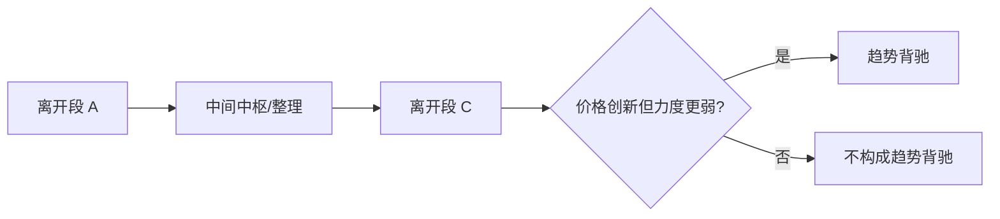
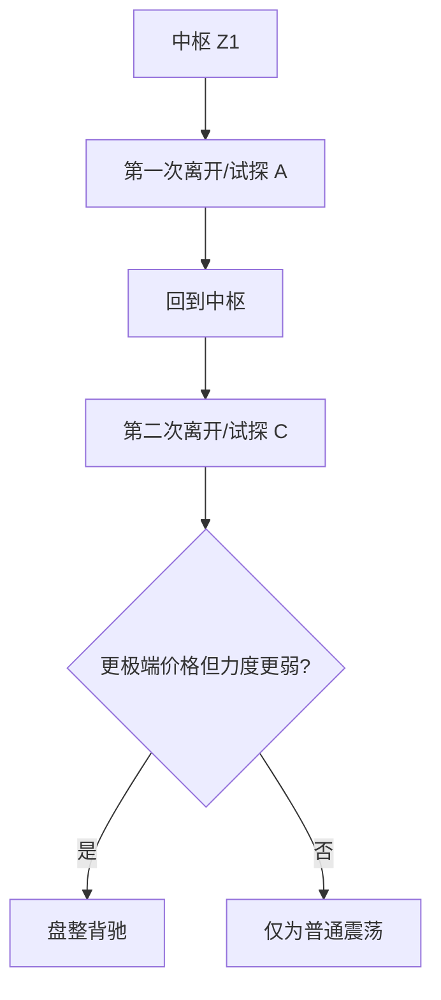
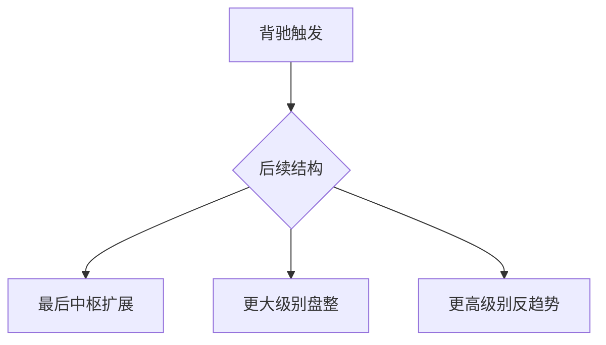
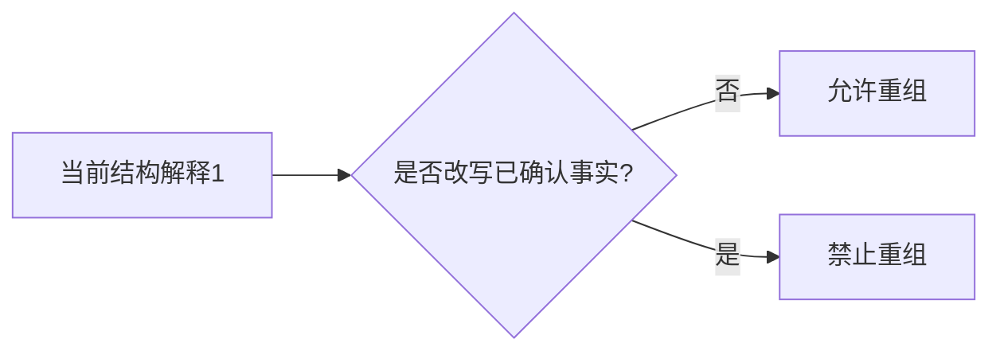
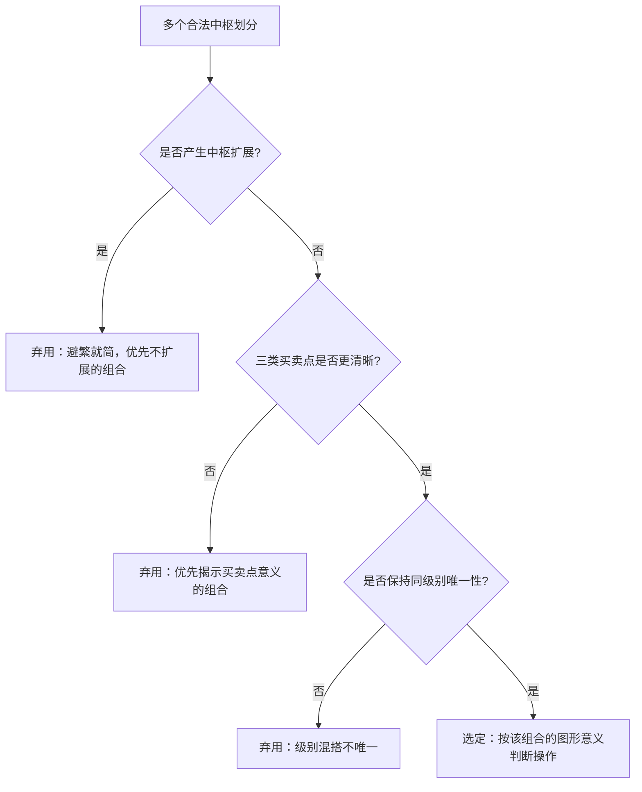

# 走势类型与背驰图文化示例库（V1）

本页提供走势类型、趋势背驰、盘整背驰模块的图文化示例模板。

使用原则：

- 所有图示先说明“当前级别结构语义”，再讨论指标或执行层。
- 必须区分“已完成结构”和“当前进行结构”。
- 背驰示例必须显式标出比较对象、最近中枢和所属级别。

## 1. 完成走势与当前进行结构示例

场景目标：演示为什么图上必须同时保留“上一个已完成走势 + 当前进行走势”。

图注模板：

- 必填：`last_completed`、`current_ongoing`。
- 禁止文案：不得把“当前进行结构”直接写成已完成走势类型。

### 1.1 同级别分解类型链示例

场景目标：演示 `type_chain` 如何把“已完成走势 + 当前进行走势 + 转场阶段”稳定串起来。

图注模板：

- 必填：`type_chain`、`relationship.transition_state`、`same_level_consumption_level`。
- 红线：`type_chain` 只按中枢关系切分，不得按编号硬切，也不得把 `pending` 候选态写成已完成趋势。

### 1.2 同级别分解数值化卡片

#### 1.2.1 `up -> range`（前段完成，新段候选）

- 结构语义：前段上涨已完成，当前新段只形成一个中枢，仍处候选待确认。
- `type_chain`：`[{type: up, status: completed, zs_count: 2}, {type: range, status: ongoing, zs_count: 1}]`
- 转场字段：`transition_state=candidate_new_type`，`current_structure_status=candidate_completed_waiting_stability`。
- 消费字段：`same_level_consumption_level=pending`。
- 回归锚点：`test_build_structure_state_type_chain_matches_last_completed_and_ongoing`。

#### 1.2.2 `up -> down -> range`（多 run 折叠）

- 结构语义：历史上已完成两个同级别 run，当前尾段为盘整进行中。
- `type_chain`：`up(completed,2) -> down(completed,2) -> range(ongoing,1)`。
- 红线：早前 run 可以折叠为 `completed`，但当前 ongoing 尾段不得被吞掉。
- 回归锚点：`test_build_structure_state_type_chain_folds_multiple_completed_runs`。

#### 1.2.3 `up -> range -> up`（单 run 内多段切换）

- 结构语义：同一 live run 内部出现类型切换，前缀必须完整展开，不能只保留最后一段。
- `type_chain`：`up(completed,2) -> range(completed,2) -> up(ongoing,4)`。
- 红线：`last_completed` 只指向最近 completed 块，但 `type_chain` 必须保留更早 completed 前缀。
- 回归锚点：`test_build_structure_state_type_chain_enumerates_in_run_type_switches`。

## 2. 趋势背驰示例

场景目标：演示同级别两个同向离开段的力度比较。

图注模板：

- 必填：比较级别、最近中枢、力度代理。
- 红线：没有趋势，不得判趋势背驰。

## 3. 盘整背驰示例

场景目标：演示同一中枢语义下的脱离失败。

图注模板：

- 必填：同一中枢语义、两次离开/试探对象。
- 禁止文案：不得把盘整背驰直接写成趋势背驰。

## 4. 背驰后三级去向示例

场景目标：演示背驰后只能进入三类去向。

图注模板：

- 必填：`post_divergence_route`、`route_level_from`、`route_level_to`。
- 禁止文案：不得出现第四种去向。

## 5. 重组边界示例

场景目标：演示允许重组与禁止重组的分界。

图注模板：

- review 重点：是否跨越已确认边界。
- 降级策略：若仍有多义，只能输出 pending/观察态。

### 5.1 通过结合律选择最适合当下的中枢

场景目标：在多个合法中枢划分中，按结合律选择最适合当下的中枢。

图注模板：

- 选择依据：避繁就简 → 利于操作（三类买卖点） → 级别一致。
- 锁定后不得混用其它组合的结论。
- 理论依据：[trend-ambiguity-combination-law.md](trend-ambiguity-combination-law.md)。

## 6. 实盘案例卡片模板

### 6.1 完成/进行结构卡片

- 标的/级别/时间窗：
- 上一个已完成走势：
- 当前进行走势：
- 是否已稳定切分：是 | 否

### 6.2 趋势背驰卡片

- 标的/级别/时间窗：
- 比较对象：
- 最近中枢：
- 力度代理：
- 结论：趋势背驰 | 非趋势背驰

### 6.3 盘整背驰卡片

- 标的/级别/时间窗：
- 所属中枢：
- 两次离开/试探对象：
- 结论：盘整背驰 | 普通震荡

## 7. 配套文档跳转

- 理论规格：[same-level-decomposition-spec.md](same-level-decomposition-spec.md)
- 理论规格：`trend-divergence-spec.md`
- 原文复核矩阵：`trend-divergence-original-review-matrix.md`
- 主入口：`chanlun-rule-spec.md`

## 8. 案例 → 回归映射表（TD5 首版）

| 案例 | 结论 | 回归锚点（`tests/test_chanlun_analysis.py`） |
| --- | --- | --- |
| 同级别分解：`completed up + ongoing range` | `type_chain` 同时保留已完成段与当前候选段 | `test_build_structure_state_type_chain_matches_last_completed_and_ongoing` |
| 同级别分解：`candidate_new_type` cutoff 原型 | `down completed -> range ongoing`，`transition_state=candidate_new_type`，`pending` | 由 `build/scan_real_candidate_new_type_samples.py` 继续扫描当前 live 锚点 |
| 同级别分解：多 run 折叠 | 历史 run 折叠为 `completed`，当前尾段保留 `ongoing` | `test_build_structure_state_type_chain_folds_multiple_completed_runs` |
| 同级别分解：单 run 内多段切换 | `type_chain` 完整枚举 `up -> range -> up` 前缀 | `test_build_structure_state_type_chain_enumerates_in_run_type_switches` |
| 趋势背驰正例：趋势 + 离开段突破 ZG + 力度衰减 | `divergence.trend.strict=True`，`post_divergence_route=higher_level_reverse_trend` | `test_analyze_chanlun_signals_marks_trend_divergence_as_higher_level_reverse_trend` |
| 趋势背驰反例：力度衰减但离开段未突破 | `trend.active=True` 但 `strict=False`，`post_divergence_route=last_zs_extension` | `test_analyze_chanlun_signals_trend_divergence_without_departure_confirmation_is_not_strict` |
| 盘整背驰正例：盘整 + 试探边界 + 力度衰减 | `divergence.range.strict=True`，`post_divergence_route=higher_level_range` | `test_analyze_chanlun_signals_marks_range_divergence_as_higher_level_range` |
| 盘整背驰反例：力度衰减但未试探到边界 | `range.active=True` 但 `strict=False`，`post_divergence_route=last_zs_extension` | `test_analyze_chanlun_signals_range_divergence_without_touching_boundary_is_not_strict` |
| 趋势 vs 盘整分轨：同一结构不会同时落入两条背驰判定轨 | `trend.active` 与 `range.active` 互斥（up/down -> trend 轨，range -> range 轨） | `test_analyze_chanlun_signals_trend_and_range_divergence_tracks_are_mutually_exclusive` |
| 趋势 vs 盘整分轨 | `ongoing_type=up/down` 走 `trend`，`range` 走 `range`，不复用分支 | 上述四例共同覆盖 |

真实过渡态样本绑定：`candidate_new_type` 当前以历史 cutoff 原型 + `build/scan_real_candidate_new_type_samples.py` 扫描工具补位；其余同级别过渡态仍可继续扩更多标的/级别样本。

## 9. 正例 / 反例 / 易混淆例（数值化卡片）

下面用「结构语义 + 关键数值 + 字段结论」把正例、反例、易混淆例写成可直接 review 的卡片。

### 9.0 同级别分解正例 / 易混淆例

#### 9.0.1 正例：前段完成，当前新段仍处候选待确认

- 结构语义：上一段 `up` 已结束，当前仅有一个新中枢，暂不能把新段写成完成趋势。
- 关键字段：`type_chain=[up(completed), range(ongoing)]`，`transition_state=candidate_new_type`。
- 消费结论：`same_level_consumption_level=pending`，文案应写“候选待确认”。
- 当前 live 锚点由 `build/scan_real_candidate_new_type_samples.py` 继续扫描补位；本卡片保留作语义原型。

#### 9.0.2 易混淆例：单 run 内部类型切换

- 结构语义：虽然当前 ongoing 为 `up`，但中间曾出现 `range` completed 块。
- 关键字段：`type_chain=[up(completed), range(completed), up(ongoing)]`。
- 消费红线：不得因为当前末段是 `up`，就把中间 `range` 省略掉。

### 9.1 趋势背驰正例

- 结构语义：`ongoing_type=up`，最近中枢 `ZG=100`，离开段向上突破 `ZG`。
- 关键数值：离开段 `bi.high=110 > 100`；`strength_comparison.decayed=True`。
- 字段结论：`divergence.trend.active=True`、`strict=True`、`departure_confirmed=True`。
- 去向：`post_divergence_route=higher_level_reverse_trend`。

### 9.2 趋势背驰反例（力度衰减但离开段未突破）

- 结构语义：`ongoing_type=up`，最近中枢 `ZG=100`，离开段未突破 `ZG`。
- 关键数值：离开段 `bi.high=98 < 100`；`strength_comparison.decayed=True`。
- 字段结论：`divergence.trend.active=True` 但 `strict=False`、`departure_confirmed=False`。
- 去向：`post_divergence_route=last_zs_extension`。
- 消费红线：这是「力度衰减迹象」，不得写成严格趋势背驰。

### 9.3 盘整背驰正例

- 结构语义：`ongoing_type=range`，同一中枢语义下两次同方向试探，后一次触及边界。
- 关键数值：试探 `bi.high >= ZG=100`；`strength_comparison.decayed=True`。
- 字段结论：`divergence.range.active=True`、`strict=True`、`touches_boundary=True`。
- 去向：`post_divergence_route=higher_level_range`。

### 9.4 盘整背驰反例（力度衰减但未试探到边界）

- 结构语义：`ongoing_type=range`，同方向试探未触及中枢边界。
- 关键数值：试探 `bi.high=98 < ZG=100`；`strength_comparison.decayed=True`。
- 字段结论：`divergence.range.active=True` 但 `strict=False`、`touches_boundary=False`。
- 去向：`post_divergence_route=last_zs_extension`。
- 消费红线：只是普通震荡力度衰减，不是严格盘整背驰。

### 9.5 易混淆例（趋势 vs 盘整分轨）

- 结构语义：同一结构只落入一条判定轨——`ongoing_type=up/down` 走 `trend` 轨，`ongoing_type=range` 走 `range` 轨。
- 字段结论：`divergence.trend.active` 与 `divergence.range.active` 互斥，不会同时为真。
- 消费红线：不得把「盘整内同向试探力度衰减」误写成趋势背驰。

