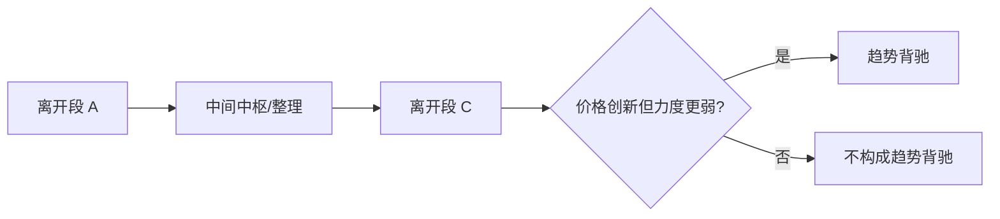
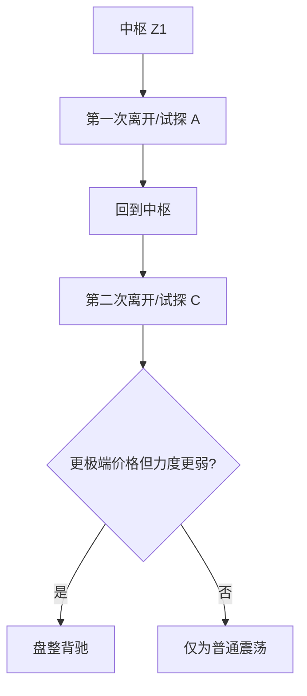
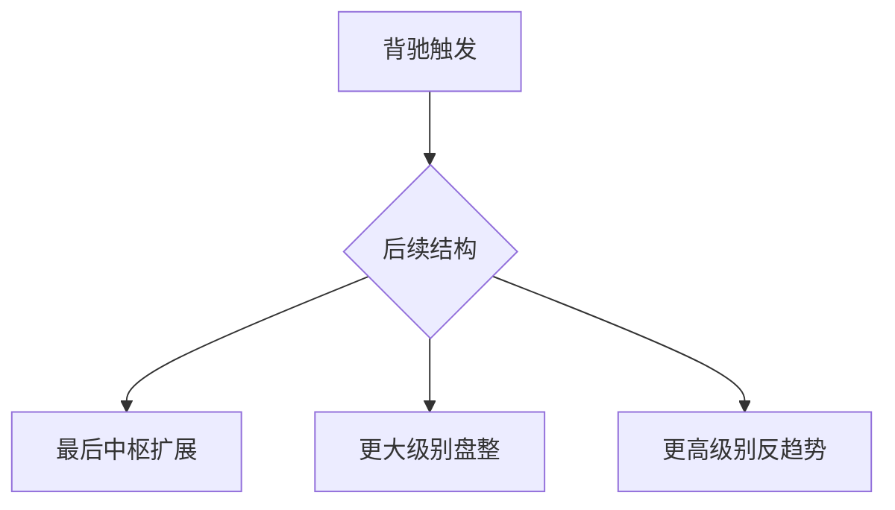
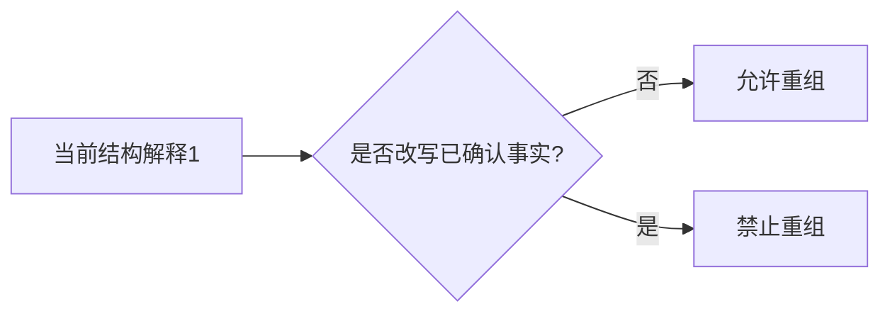

# 走势类型与背驰图文化示例库（V1）

本页提供走势类型、趋势背驰、盘整背驰模块的图文化示例模板。

使用原则：

- 所有图示先说明“当前级别结构语义”，再讨论指标或执行层。
- 必须区分“已完成结构”和“当前进行结构”。
- 背驰示例必须显式标出比较对象、最近中枢和所属级别。

## 1. 完成走势与当前进行结构示例

场景目标：演示为什么图上必须同时保留“上一个已完成走势 + 当前进行走势”。

图注模板：

- 必填：`last_completed`、`current_ongoing`。
- 禁止文案：不得把“当前进行结构”直接写成已完成走势类型。

## 2. 趋势背驰示例

场景目标：演示同级别两个同向离开段的力度比较。

图注模板：

- 必填：比较级别、最近中枢、力度代理。
- 红线：没有趋势，不得判趋势背驰。

## 3. 盘整背驰示例

场景目标：演示同一中枢语义下的脱离失败。

图注模板：

- 必填：同一中枢语义、两次离开/试探对象。
- 禁止文案：不得把盘整背驰直接写成趋势背驰。

## 4. 背驰后三级去向示例

场景目标：演示背驰后只能进入三类去向。

图注模板：

- 必填：`post_divergence_route`、`route_level_from`、`route_level_to`。
- 禁止文案：不得出现第四种去向。

## 5. 重组边界示例

场景目标：演示允许重组与禁止重组的分界。

图注模板：

- review 重点：是否跨越已确认边界。
- 降级策略：若仍有多义，只能输出 pending/观察态。

## 6. 实盘案例卡片模板

### 6.1 完成/进行结构卡片

- 标的/级别/时间窗：
- 上一个已完成走势：
- 当前进行走势：
- 是否已稳定切分：是 | 否

### 6.2 趋势背驰卡片

- 标的/级别/时间窗：
- 比较对象：
- 最近中枢：
- 力度代理：
- 结论：趋势背驰 | 非趋势背驰

### 6.3 盘整背驰卡片

- 标的/级别/时间窗：
- 所属中枢：
- 两次离开/试探对象：
- 结论：盘整背驰 | 普通震荡

## 7. 配套文档跳转

- 理论规格：`trend-divergence-spec.md`
- 原文复核矩阵：`trend-divergence-original-review-matrix.md`
- 主入口：`chanlun-rule-spec.md`

## 8. 案例 → 回归映射表（TD5 首版）

| 案例 | 结论 | 回归锚点（`tests/test_chanlun_analysis.py`） |
| --- | --- | --- |
| 趋势背驰正例：趋势 + 离开段突破 ZG + 力度衰减 | `divergence.trend.strict=True`，`post_divergence_route=higher_level_reverse_trend` | `test_analyze_chanlun_signals_marks_trend_divergence_as_higher_level_reverse_trend` |
| 趋势背驰反例：力度衰减但离开段未突破 | `trend.active=True` 但 `strict=False`，`post_divergence_route=last_zs_extension` | `test_analyze_chanlun_signals_trend_divergence_without_departure_confirmation_is_not_strict` |
| 盘整背驰正例：盘整 + 试探边界 + 力度衰减 | `divergence.range.strict=True`，`post_divergence_route=higher_level_range` | `test_analyze_chanlun_signals_marks_range_divergence_as_higher_level_range` |
| 盘整背驰反例：力度衰减但未试探到边界 | `range.active=True` 但 `strict=False`，`post_divergence_route=last_zs_extension` | `test_analyze_chanlun_signals_range_divergence_without_touching_boundary_is_not_strict` |
| 趋势 vs 盘整分轨：同一结构不会同时落入两条背驰判定轨 | `trend.active` 与 `range.active` 互斥（up/down -> trend 轨，range -> range 轨） | `test_analyze_chanlun_signals_trend_and_range_divergence_tracks_are_mutually_exclusive` |
| 趋势 vs 盘整分轨 | `ongoing_type=up/down` 走 `trend`，`range` 走 `range`，不复用分支 | 上述四例共同覆盖 |

真实过渡态样本绑定：暂被上游 `1m pre_breakdown` 锚点漂移阻塞（见 [zhongshu-tasks.md](zhongshu-tasks.md) ZS5.3.b），待重新选锚点后回填。

