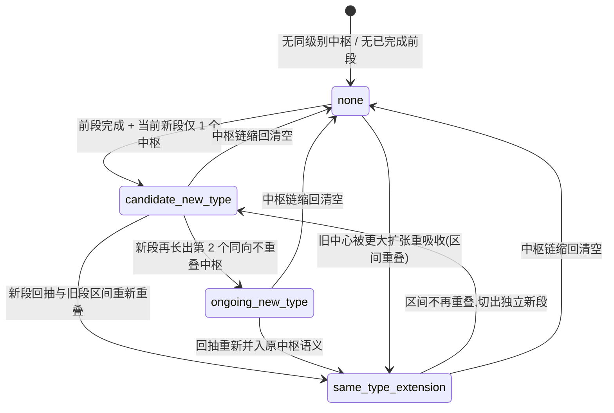

# 中枢完成 / 扩张 / 新中枢状态机

本页把“中枢还在、刚完成、还是已经换成新中枢”拆成统一状态机，是 ZS2 的交付说明。
机器字段由 `src/chanlun/analysis.py::build_structure_state(...)` 生成，理论口径见
[zhongshu-core-spec.md](zhongshu-core-spec.md)。

## 1. 术语表

| 术语 | 含义 | 机器表现 |
| --- | --- | --- |
| 扩张 / 延伸 | 相邻同级别中枢区间重叠，走势类型继续延伸 | `transition_state=same_type_extension` 或 reabsorbed lineage |
| 完成 | 一个中枢 run 被后续同级别结构确认终结 | `last_completed` 非空 |
| 监视中 / pending | 只有单个中枢或新段候选，证据不足以下强结论 | `consumption_level=pending` |
| 新中枢候选 | 前段已完成，当前新段仅 1 个同级别中枢 | `transition_state=candidate_new_type` |
| 新中枢进行中 | 前段已完成，当前新段 ≥2 个中枢 | `transition_state=ongoing_new_type` |

## 2. 状态图

说明：状态不持久，每次重建都从最终中枢链重新推导；上图只描述可达状态与切换方向。

## 3. 状态定义（对应机器字段）

- `none`：没有足够证据推出转场结论。**不是错误态**，消费端不得渲染成“无结构”。
- `same_type_extension`：`last_completed.type == current_ongoing.type`，当前按前一走势类型内部延伸处理。
- `candidate_new_type`：`last_completed.type != current_ongoing.type` 且当前新段 `zs_count_so_far == 1`，只能按 watch / pending 展示。
- `ongoing_new_type`：`last_completed.type != current_ongoing.type` 且当前新段 `zs_count_so_far >= 2`，允许更强结构表述，但仍不等价于买卖点已确认。

走势类型由中枢区间关系决定（`_relation_kind`）：

- `range`：两个中枢区间重叠（盘整）
- `up`：`current.zs_low > previous.zs_high`（向上趋势）
- `down`：`current.zs_high < previous.zs_low`（向下趋势）

## 4. 判定顺序清单

1. 先按 `superseded_by_zs_id` / `is_reabsorbed_by_larger_expansion` 切出 live runs（剔除被重吸收中心）。
2. 判定当前 run 的类型（前两个中枢的区间关系 → `range/up/down`）。
3. 判定 `last_completed`（前一个 run 或前一个类型段）。
4. 比较 `last_completed.type` 与 `current_ongoing.type`：
   - 同类型 → `same_type_extension`（原中枢继续扩张）
   - 异类型 → 新走势（进入第 5 步）
5. 新走势按当前段中枢数分档：
   - 1 个中枢 → `candidate_new_type`（pending）
   - ≥2 个中枢 → `ongoing_new_type`
6. 特例：旧中心被更大扩张重吸收（exit→entering 复用 + 区间重叠）→ 归入 `same_type_extension`，不算独立完成。

## 5. 典型冲突案例表

| 冲突 | 裁决 | 结果 |
| --- | --- | --- |
| 回抽重新进入原中枢 vs 在原中枢之后生成新中枢 | 区间重叠优先 → 重进原中枢 | `same_type_extension` |
| 离开失败并回 vs 真正离开 | 只有同向 + 突破 ZG/ZD 才终结 | 未突破 → 本体延伸；突破 → `is_terminated` |
| 旧中心被更大扩张吸收 vs 独立完成 | exit→entering 复用 + 区间重叠 → 重吸收 | `superseded_by_zs_id`，不算独立 `last_completed` |
| 单中枢候选 vs 已确认新走势 | 1 中枢=pending，≥2 中枢才 ongoing | `candidate_new_type` vs `ongoing_new_type` |
| 中枢链缩回 vs 保留旧中心 | 缩回 → 整体清空 | `transition_state=none`、`consumption_level=auxiliary` |

## 6. 消费红线

- `transition_state` 只表达转场阶段，不单独表达 confirmed/pending/auxiliary 三态；消费等级一律读 `consumption_level`。
- `candidate_new_type` 必须保持 watch / pending 风格，不得包装成已确认趋势延续。
- `same_type_extension` 按“未切换新走势”对待。
- `none` 不得被渲染成“无结构 / 无中枢”。

## 7. 回归锚点

- 转场三态：`tests/test_chanlun_analysis.py`（无已完成前段 / 新段候选待确认 / 新段进行中）
- 重吸收尾段：`tests/test_chanlun_analysis.py::test_build_structure_state_terminated_tail_may_still_be_higher_level_expansion`、
  `test_build_structure_state_auto_detects_reabsorbed_tail_from_identified_zhongshus`
- 消费等级三态：`tests/test_chanlun_analysis.py`、`tests/test_build_miniapp_publish_bundle.py`
- 真实窗口：`tests/test_zhongshu_regression_real_fixtures.py`（`00700 30m` 单活跃中枢 → pending 等）
