# 中枢图文化示例库（V1）

本页提供“中枢主口径 + 类中枢辅口径”的图文化示例模板，服务于培训、复盘和发布层解释统一。

使用原则：

- 所有示例先给中枢主结论，再给类中枢辅助结论。
- 预警不等于确认，图文必须显式区分 `watch/pending` 与 `confirmed`。
- 若主辅冲突，图注中必须出现“中枢主口径优先”。

## 1. 第18/20课：中枢定理与扩张示例

场景目标：演示“中枢可扩张，但未必立即切分为新走势类型”。

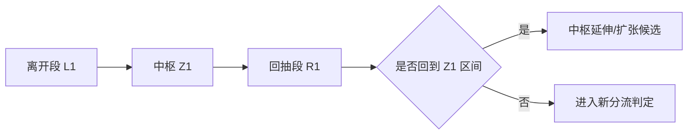

图注模板：

- 主结论：当前更接近中枢延伸，走势类型边界待稳定。
- 辅结论：类中枢给出更激进切分，仅作辅助观察。

当前可直接进入 review 的现成案例：

1. [sample-case-pack-2026-08-v1.md](sample-case-pack-2026-08-v1.md) 第 1 节 `SZ.300750 30m` 背驰后更大级别盘整候选。
2. [sample-case-pack-2026-08-v2.md](sample-case-pack-2026-08-v2.md) 第 1.1 节 `SZ.000651 30m` 背驰后更大级别盘整候选。
3. [data/reports/02357/1m/tech.json](data/reports/02357/1m/tech.json) `HK.02357 1m` 单中枢盘整进行中、无确认买卖点。
4. [data/reports/01339/1m/tech.json](data/reports/01339/1m/tech.json) `HK.01339 1m` 前段已完成、当前新段进行中、无确认买卖点。

### 1.1 真实案例 A: SZ.000651 30m 中枢扩张候选但未立即切成新走势

- 标的/级别/时间窗：SZ.000651 / 30m / 2026-07-12 ~ 2026-08-10
- 当前主结构结论：背驰后更偏更大级别盘整候选，未升级为反转
- 当前 review 视角：右侧回抽更接近“中枢扩张/延伸继续解释”，而不是立即切出全新走势类型
- 级别映射：`route_level_from=30m` -> `route_level_to=day`

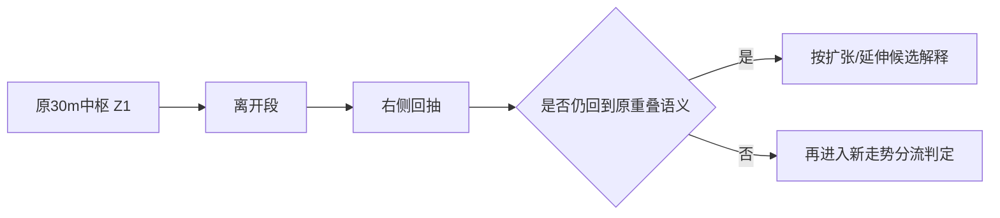

图上 review 重点：

- 这类案例的重点不是“有没有离开段”，而是右侧回抽后，原中枢语义是否仍然成立。
- 只要更接近原重叠区间的延续或扩张，就不应急于把它切成全新走势类型。
- 从消费表达上看，这种场景更适合写成“更大级别盘整观察期”，而不是“新趋势已确认”。
- 最终文案可固定为：`当前更接近中枢扩张，走势类型边界待稳定。`

### 1.2 真实案例 B: HK.02357 1m 单中枢盘整进行中，仍属观察态

- 标的/级别/时间窗：HK.02357 / 1m / 2026-07-30 10:18 ~ 2026-08-14 16:00
- 当前中枢数量：`1`
- 最新中枢区间：`2.98 - 2.985`
- 当前进行结构：`range`
- `current_structure_status`：`ongoing_same_type`
- 当前信号结论：无确认一二三类买卖点

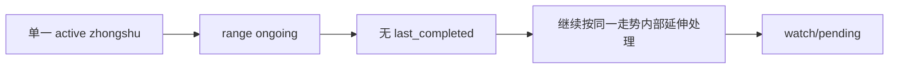

图上 review 重点：

- 这个 `1m` 案例最关键的不是价格偏强还是偏弱，而是当前只有一个同级别中枢，结构还不足以确认新的走势分流。
- `relationship.kind=undetermined` 与 `current_structure_status=ongoing_same_type` 应被消费端稳定解释成观察态，而不是强行推成确认趋势或确认买卖点。
- 它正好和 `1.3`、`4.3` 形成 `1m` 三态对照中的第一档：一个是盘整未完成，一个是前段完成但新段仍在运行，一个是确认链已闭合。
- 最终文案可固定为：`当前只有一个同级别中枢，先按盘整进行中观察。`

### 1.3 真实案例 C: HK.01339 1m 前段已完成，当前新同级别走势正在运行

- 标的/级别/时间窗：HK.01339 / 1m / 2026-07-31 14:25 ~ 2026-08-14 16:00
- 当前中枢数量：`4`
- 上一个已完成走势类型：`up`
- 当前进行结构：`down`
- `relationship.kind`：`completed_then_new_type_ongoing`
- `current_structure_status`：`completed_then_new_type`
- 当前信号结论：无确认一二三类买卖点

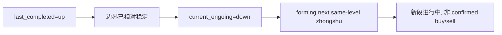

图上 review 重点：

- 这个 `1m` 案例比 `1.2` 更进一步，因为它不是“只有一个中枢、关系未定”，而是前一段同级别走势已经结束，当前正在运行的是新的同级别走势类型。
- 但“前段已完成”不等于“当前新段已给出确认买卖点”，所以消费端必须把它和 `4.3` 的 confirmed `3S` 分开。
- `current_structure_status=completed_then_new_type` 应被解释成结构切换已发生、当前新段仍在展开，而不是直接输出交易动作型确认。
- 最终文案可固定为：`上一段同级别走势已结束，当前新段运行中，继续观察是否形成有效确认。`

#### 1.3.1 补充对照：`candidate_new_type` 历史 cutoff 单中枢原型

- 标的/级别/时间窗：历史 `1m` cutoff 原型（旧 `06088 1m` 窗口曾出现，当前 live 数据需重新扫描）
- 当前中枢数量：`3`
- 上一个已完成走势类型：`down`
- 当前进行结构：`range`
- `relationship.kind`：`completed_then_new_type_ongoing`
- `transition_state`：`candidate_new_type`
- `current_structure_status`：`candidate_completed_waiting_stability`
- `same_level_consumption_level`：`pending`
- 当前信号结论：无确认一二三类买卖点

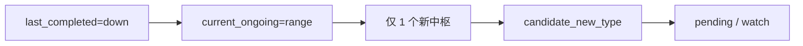

图上 review 重点：

- 这个真实 `1m` cutoff 比 `1.3` 更早一步：它已经有 `last_completed`，但当前新段只有 1 个同级别中枢，因此只能落在 `candidate_new_type`。
- `transition_state=candidate_new_type` 与 `same_level_consumption_level=pending` 必须成对解释，不能只因为前段已完成，就把当前新段包装成已确认趋势延续。
- 它正好补齐 `1.2` 单中枢未定、`1.3` 新段进行中之外的第三档：前段完成后，新段候选但尚未形成第 2 个同级别中枢。
- 当前 live 数据中的具体锚点需通过 `build/scan_real_candidate_new_type_samples.py` 重扫；本节保留作语义原型卡片。

### 1.4 进入段 / 本体 / 离开段分层图（ZS6.1）

场景目标：把标准中枢的进入段 / 本体 / 离开段三层边界画清，避免把进入段当本体、把离开段并回本体。

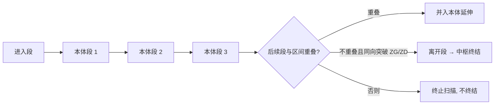

图示字段说明：

- `entering_segment_id`：进入段，只负责把走势带入重叠区，**不计入本体**。
- `core_segment_ids`：本体前三段（`start_segment_id` .. `end_segment_id`）。
- `zs_low / zs_high`：由本体前三段重叠固定，不随延伸重算。
- `exit_segment_id`：与进入段同向、突破 ZG/ZD 的离开段；未出现则为 `None`。
- 延伸段只推进 `render_end_segment_id`，不改变 `zs_low / zs_high`。

真实锚点：`00700 30m` 首个标准中枢 `entering=0, core=[1,2,3], exit=None`；最小例子见
[segment-zhongshu-boundary.md](segment-zhongshu-boundary.md) 第 6 节。

## 2. 第29课：背驰后三级去向示例

场景目标：演示背驰后只允许三类去向。

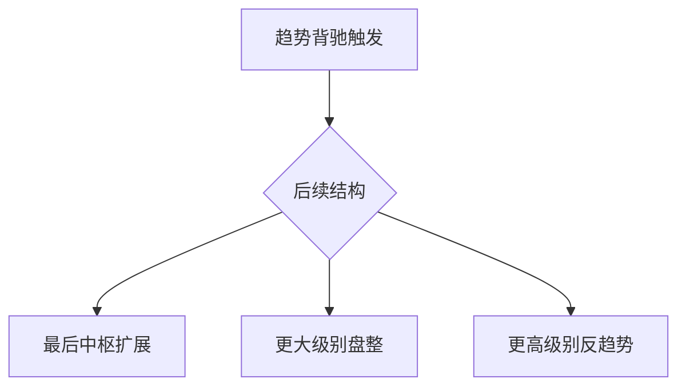

图注模板：

- 必填字段：`post_divergence_route`、`route_level_from`、`route_level_to`。
- 禁止文案：不得出现“第四种去向”。

当前可直接进入 review 的现成案例：

1. [sample-case-pack-2026-08-v1.md](sample-case-pack-2026-08-v1.md) 第 1 节 `SZ.300750 30m` `higher_level_range`。
2. [sample-case-pack-2026-08-v2.md](sample-case-pack-2026-08-v2.md) 第 1.1 节 `SZ.000651 30m` `higher_level_range`。
3. [sample-case-pack-2026-08-v2.md](sample-case-pack-2026-08-v2.md) 第 2.2 节 `HK.00700 60m` `higher_level_reverse_trend` 候选。
4. [sample-case-pack-2026-08-v2.md](sample-case-pack-2026-08-v2.md) 第 3.2 节 `HK.02318 30m` 反趋势候选回退到 `higher_level_range`。

### 2.1 真实案例 A: SZ.000651 30m 背驰后进入更大级别盘整候选

- 标的/级别/时间窗：SZ.000651 / 30m / 2026-07-12 ~ 2026-08-10
- 去向判定：`higher_level_range`
- 级别映射：`route_level_from=30m` -> `route_level_to=day`
- 当前结构结论：背驰后更偏更大级别盘整，不升级为反转

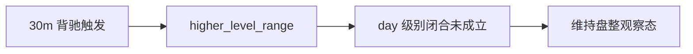

图上 review 重点：

- 关键不是“已经转成日线盘整”，而是去向已偏向更大级别盘整，但级别闭合还没成立。
- 这类场景允许提升结构解释层级，但不允许越级写成“反转已确认”。
- 如果类中枢给出更激进方向，页面文案仍应保持“中枢主口径优先”。
- 最终文案可固定为：`背驰后进入更大级别盘整观察期。`

### 2.2 真实案例 B: HK.00700 60m 背驰后进入更高级别反趋势候选

- 标的/级别/时间窗：HK.00700 / 60m / 2026-07-25 ~ 2026-08-13
- 去向判定：`higher_level_reverse_trend`
- 级别映射：`route_level_from=60m` -> `route_level_to=day`
- 当前结构结论：去向偏反趋势，但仍属于高风险观察，不确认反转

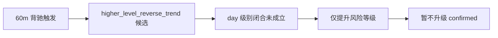

图上 review 重点：

- `higher_level_reverse_trend` 只说明当前最强去向候选，不等于更高一级反转已完成。
- 只要完整离开-回抽确认链还没闭合，就必须停留在 watch/pending 或高风险观察态。
- 这类案例特别适合检查报告和小程序是否偷换成“已反转”措辞。
- 最终文案可固定为：`去向偏反趋势，但级别未闭合。`

## 3. 第39课：A_i 与 A_i+2 节奏示例

场景目标：演示力度比 `r` 只用于节奏监视，不直接确认买卖点。

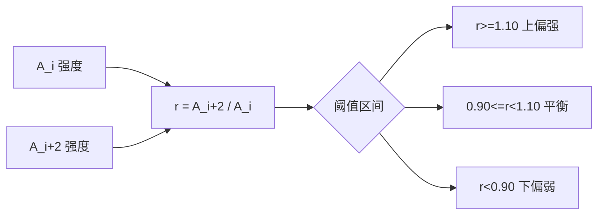

图注模板：

- `oscillation_rhythm_state=up_bias|balanced|down_bias|pending`
- 结论降级：若 `dual_interpretation_pending`，仅输出观察态。

当前可直接进入 review 的现成案例：

1. [sample-case-pack-2026-08-v1.md](sample-case-pack-2026-08-v1.md) 第 2 节 `SH.600519 5m` `down_bias` 且降级观察。
2. [sample-case-pack-2026-08-v2.md](sample-case-pack-2026-08-v2.md) 第 1.2 节 `SH.601318 5m` `down_bias`。
3. [sample-case-pack-2026-08-v2.md](sample-case-pack-2026-08-v2.md) 第 2.3 节 `HK.01024 15m` `balanced`。
4. [rhythm-replay-log-2026-08-first-batch.md](rhythm-replay-log-2026-08-first-batch.md) 第 5 节 第一批阈值正负例摘要。
5. [rhythm-replay-log-2026-08-second-batch.md](rhythm-replay-log-2026-08-second-batch.md) 第 6 节 第二批跨市场关键案例摘要。

### 3.1 真实案例 A: SH.601318 5m 节奏下偏弱但不确认卖点

- 标的/级别/时间窗：SH.601318 / 5m / 2026-08-06 ~ 2026-08-13
- `A_i` 强度：2.31
- `A_{i+2}` 强度：1.89
- `r` 值：`0.818`
- `oscillation_rhythm_state`：`down_bias`
- 当前结构结论：执行端降级为 `watch/pending`

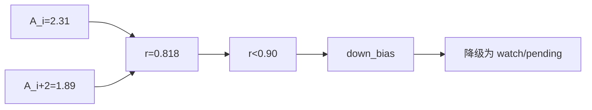

图上 review 重点：

- `down_bias` 只表示当前节奏偏弱，不能直接替代卖点确认链。
- 即使方向倾向已经很明显，只要分解仍待稳定，消费端也应先降级到观察态。
- 这类案例适合检查是否有人把“节奏下偏弱”偷换成“卖点已确认”。
- 最终文案可固定为：`节奏偏弱，先维持观察。`

### 3.2 真实案例 B: HK.01024 15m 节奏平衡时维持中性观察

- 标的/级别/时间窗：HK.01024 / 15m / 2026-08-01 ~ 2026-08-13
- `A_i` 强度：1.94
- `A_{i+2}` 强度：1.99
- `r` 值：`1.026`
- `oscillation_rhythm_state`：`balanced`
- 当前结构结论：维持中性观察，不给方向性确认

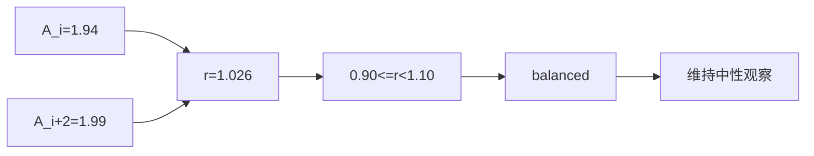

图上 review 重点：

- `balanced` 的价值是明确“暂时没有节奏优势”，不是给出模糊方向判断。
- 这种状态下最容易出现文案过度解读，尤其是把中性观察写成偏多或偏空。
- 如果别的辅助信号更激进，也必须保留“当前节奏仍平衡”的约束说明。
- 最终文案可固定为：`结构节奏平衡，暂未出现方向性优势。`

## 4. 第92课：监视器预警与确认链对照示例

场景目标：演示 `pre_breakout/pre_breakdown` 与 `confirmed_3B/3S` 的边界，以及“预警未确认”和“确认链已闭合”如何区分。

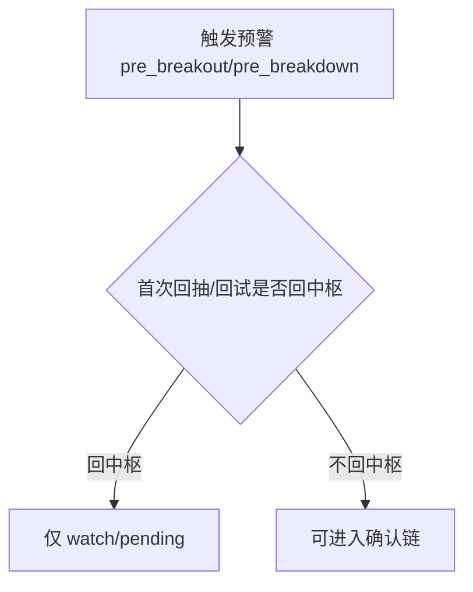

图注模板：

- 若首次回抽/回试回中枢：`不得输出 confirmed`。
- 若条件未闭合：`高风险观察，待确认`。

当前可直接进入 review 的现成案例：

1. [sample-case-pack-2026-08-v1.md](sample-case-pack-2026-08-v1.md) 第 3 节 `HK.01024 60m` `pre_breakdown` 后回中枢。
2. [sample-case-pack-2026-08-v2.md](sample-case-pack-2026-08-v2.md) 第 1.3 节 `SZ.002594 30m` `pre_breakout` 后回中枢。
3. [sample-case-pack-2026-08-v2.md](sample-case-pack-2026-08-v2.md) 第 2.1 节 `HK.00388 60m` `pre_breakdown` 后回中枢。
4. [sample-case-pack-2026-08-v2.md](sample-case-pack-2026-08-v2.md) 第 3.3 节 `SZ.300124 15m` 预警后确认失败。
5. [data/reports/000651/1m/tech.json](data/reports/000651/1m/tech.json) `SZ.000651 1m` 已真实落盘 `pre_breakdown`，当前仍属 pending/watch。
6. [build/scan_real_1m_prebreakout_samples.json](build/scan_real_1m_prebreakout_samples.json) `002555 1m` 在历史回放 `2026-08-04 13:35` 已出现真实 `pre_breakout`，且仍保留 pending/watch。
7. [data/reports/601328/1m/tech.json](data/reports/601328/1m/tech.json) `SH.601328 1m` 顶背驰迹象已出现，但仍停留在等待离开中枢的预警前态。

当前 `1m` 接线规则：真实 `SZ.000651 1m pre_breakdown` 与真实 replay `002555 1m pre_breakout` 已经接入第 92 课的双向主预警锚点，`SH.601328 1m` 退回“预警前态代理”角色；`1m confirmed 3S` 当前则只保留为 regression reference，对应消费输出的 confirmed 对照。

### 4.1 真实案例 A: HK.01024 60m 向下预警后首次回抽回中枢

- 标的/级别/时间窗：HK.01024 / 60m / 2026-07-28 ~ 2026-08-13
- 预警类型：`pre_breakdown`
- 首次回抽/回试是否回中枢：是
- 当前信号等级：`watch/pending`
- 当前结构结论：预警成立，但三卖未确认

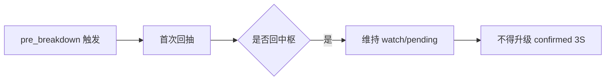

图上 review 重点：

- 这个案例最关键的不是“跌过了某个价位”，而是首次回抽重新回到中枢区间，直接打断确认链。
- 只要这条“不回中枢”硬约束没有成立，页面和文案都只能保留预警，不得写成确认三卖。
- 如果辅口径给出更激进风险提示，也只能作为风险加注，不能覆盖主口径。
- 最终文案可固定为：`出现向下预警，但当前不构成确认三卖。`

### 4.2 真实案例 B: SZ.002594 30m 向上预警后首次回试回中枢

- 标的/级别/时间窗：SZ.002594 / 30m / 2026-07-20 ~ 2026-08-12
- 预警类型：`pre_breakout`
- 首次回抽/回试是否回中枢：是
- 当前信号等级：`watch/pending`
- 当前结构结论：三买未确认

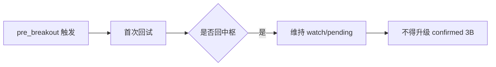

图上 review 重点：

- 这类场景最容易被误写成“突破成立”，但首次回试回中枢以后，严格口径只能回到观察态。
- 预警字段的价值是提示可能的方向，不是替代三买确认链本身。
- 上下方向的规则必须对称处理，不能下破严格、上破宽松。
- 最终文案可固定为：`出现向上预警，但当前不构成确认三买。`

### 4.3 真实案例 C: SZ.000651 1m 向下预警已落盘，但确认链尚未闭合

- 标的/级别/时间窗：SZ.000651 / 1m / 2026-07-31 13:07 ~ 2026-08-18 15:00
- 当前中枢数量：`1`
- 最新中枢区间：`40.02 - 40.26`
- 当前进行结构：`range`
- 当前信号结论：`出现向下预警，但当前不构成确认三卖`
- 关键信号说明：`价格贴近最新中枢下沿 40.02，中枢中线 40.14，节奏偏弱`

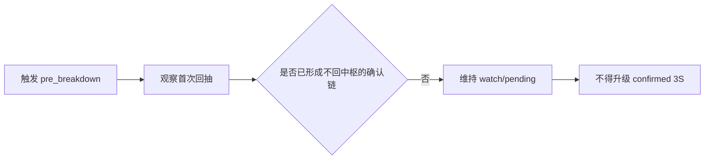

图上 review 重点：

- 这个 `1m` 案例现在补上的是真实 `pre_breakdown` 字段链，而不是 confirmed 三卖链。
- 当前 `tech.json` 已同时给出 `zs_monitor_alert=pre_breakdown`、`same_level_decomposition_mode=dual_interpretation_pending`、`oscillation_rhythm_state=down_bias` 与对应 `advice_text`，足够作为稳定的 `1m` 正式预警未确认示例。
- 这类场景适合作为 `30m/60m` 预警案例在更低级别的真实补充锚点，也适合作为 proxy negative 的直接上游对照。
- 最终文案可固定为：`出现向下预警，但当前不构成确认三卖。`

补充说明：`1m confirmed 3S` 现已由真实 `01024 1m` live 样本回补到本页，同时继续保留具名 regression reference gate 作为自动化兜底。

### 4.4 真实案例 D: 002555 1m 向上预警已通过历史回放锁定，但确认链尚未闭合

- 标的/级别/时间窗：002555 / 1m / 2026-08-04 13:05 ~ 2026-08-04 13:35
- 样本来源：`build/scan_real_1m_prebreakout_samples.json` + replay gate
- 当前中枢数量：`0`（该窗口尚未形成确认中枢，预警由监视带压上沿触发）
- 最新中枢区间：无确认中枢区间
- 当前进行结构：`range`（监视带压上沿）
- 当前信号结论：`出现向上预警，但当前不构成确认三买。`
- 关键信号说明：`价格贴近监视带上沿，中枢中线 20.09，节奏偏强；同级别消费仍是待确认。`

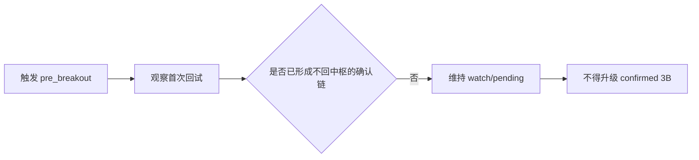

图上 review 重点：

- 这个 `1m` 案例补上的是真实历史回放 `pre_breakout` 字段链，而不是 synthetic 造数。
- 当前 replay 结果同时给出 `zs_monitor_alert=pre_breakout`、`same_level_decomposition_mode=dual_interpretation_pending`、`zs_monitor_midline=20.10`、`zs_monitor_bias=strong` 与 `消费说明：当前同级别结构处于 待确认消费`，足够作为稳定的 `1m` 正式向上预警未确认示例。
- 它和 `4.3` 的 `SZ.000651 1m pre_breakdown` 正好构成 `1m` 双向预警对照，能直接约束消费端不要把“向上预警”误写成 confirmed 三买。
- 最终文案可固定为：`出现向上预警，但当前不构成确认三买。`

### 4.5 真实案例 E: 01024 1m 已进入 confirmed 3S，但不能和预警/代理态混写

- 标的/级别/时间窗：01024 / 1m / 2026-08-07 15:31 ~ 2026-08-20 16:00
- 当前中枢数量：`2`
- 最新中枢区间：`40.00 - 40.36`
- 当前进行结构：`down`
- 当前信号结论：`跌破中枢后反抽下沿失败，当前按三卖确认处理。`
- 关键信号说明：`当前同级别结构处于已确认消费，最近卖点为三卖，参考价 33.94。`

图上 review 重点：

- 这个 `1m` 案例现在补上的是实时 `tech.json` confirmed `3S` live 卡片，不再只是 synthetic/reference gate。
- 当前 `tech.json` 已同时给出 `sell_points=[sell3]`、`same_level_consumption_level=confirmed`、`same_level_decomposition_mode=single_confirmed` 与 confirmed 结论文案，足够作为 `1m pre_break*` 的 confirmed 对照锚点。
- 它和 `4.3`、`4.4` 分别形成“向下预警未确认 / 向上预警未确认 / confirmed 三卖”三段式对照，能直接约束消费端不要把 pending/watch 与 confirmed 混写。
- 最终文案可固定为：`跌破中枢后反抽下沿失败，当前按三卖确认处理。`

### 4.6 真实案例 F: SH.601328 1m 顶背驰迹象已出现，但仍未进入 `pre_breakdown` 确认链

- 标的/级别/时间窗：SH.601328 / 1m / 2026-07-30 09:38 ~ 2026-08-14 15:00
- 当前中枢数量：`2`
- 最新中枢区间：`6.86 - 6.96`
- 当前进行结构：`down`
- 当前信号结论：无确认一二三类买卖点
- 当前观察提示：`已有顶背驰迹象，等向上离开或向下跌破后再做决策`

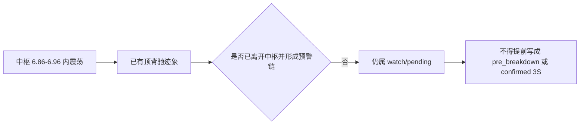

图上 review 重点：

- 这个 `1m` 样本要解决的不是“有没有顶背驰”，而是顶背驰迹象出现后，消费端能否克制地停在观察态，而不是抢先升格为 `pre_breakdown` 或 `三卖`。
- 当前仓库已经有真实 `1m pre_breakdown` 落盘样本和真实 `1m pre_breakout` 历史回放样本，因此这个案例必须明确标记为“预警前态代理样本”，不能假装它已经是正式 `pre_break*` 案例。
- 现在双向正式 `1m pre_break*` 锚点已建立，这张卡片不应继续占据 `1m` 主预警位置，而应稳定退回“字段未落盘前的前态代理/过渡说明”角色。
- 它和 `4.1`、`4.2`、`4.3` 共同构成一条更完整的链：预警前态 -> 预警未确认 -> 确认链闭合。
- 最终文案可固定为：`已有风险迹象，但仍需等待离开中枢后的预警或确认链，不提前升级。`

### 4.7 主辅冲突案例：标准中枢未确认但类中枢已给预警（ZS6.2）

场景目标：演示“辅助口径更激进”时，主结论如何保持克制，不被类中枢预警带跑。

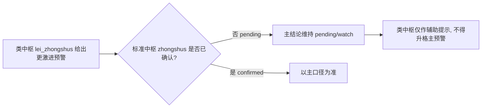

图注模板（消费红线）：

- 主口径 `same_level_consumption_level=pending` 时，无论类中枢多激进，都只能输出 `类中枢提示，未触发主预警`。
- `lei_zhongshus` 只能产出 `auxiliary_signal`，不得单独提升为 `confirmed_signal`。
- 主辅冲突固定输出“中枢主口径优先”，且不得用类中枢预警覆盖主口径的 `zs_monitor_alert`。
- 主口径 `zs_monitor_alert=none` 而类中枢出现预警时，只记录辅助预警，不升格主风险。

对应契约：[zhongshu-dual-track-spec.md](zhongshu-dual-track-spec.md) 第 9、10 节；
消费对照：[zhongshu-consumer-display-examples.md](zhongshu-consumer-display-examples.md) 第 4、7 节。

## 5. 发布层最小图文检查清单

- 是否同时展示“上一个已完成结构 + 当前进行结构”。
- 是否区分中枢（主）与类中枢（辅）图层/图例。
- 是否在预警场景下避免使用“已确认买卖点”措辞。
- 是否在主辅冲突时显示“中枢主口径优先”。

## 6. 实盘案例卡片模板（可直接填充）

以下模板用于把“示意流程图”升级成“可复核案例卡片”。

### 6.1 定理与扩张卡片（第18/20课）

- 标的/级别/时间窗：
- 主结构结论：中枢延伸 | 中枢扩张 | 新走势候选
- 关键证据：`ZG/ZD/GG/DD`、`is_terminated`、`post_divergence_route`
- 主辅差异：
- 最终文案：

优先参考现成样例：

1. [sample-case-pack-2026-08-v1.md](sample-case-pack-2026-08-v1.md) 第 1 节。
2. [sample-case-pack-2026-08-v2.md](sample-case-pack-2026-08-v2.md) 第 1.1 节。

### 6.2 背驰后去向卡片（第29课）

- 标的/级别/时间窗：
- 去向判定：`last_zs_extension | higher_level_range | higher_level_reverse_trend`
- 级别映射：`route_level_from` -> `route_level_to`
- 是否满足级别闭合：是 | 否
- 最终文案：

优先参考现成样例：

1. [sample-case-pack-2026-08-v1.md](sample-case-pack-2026-08-v1.md) 第 1 节。
2. [sample-case-pack-2026-08-v2.md](sample-case-pack-2026-08-v2.md) 第 1.1 节、第 2.2 节、第 3.2 节。

### 6.3 节奏阈值卡片（第39课）

- 标的/级别/时间窗：
- `A_i` 强度：
- `A_{i+2}` 强度：
- `r` 值与阈值区间：
- `oscillation_rhythm_state`：
- 是否触发降级：是 | 否

优先参考现成样例：

1. [sample-case-pack-2026-08-v1.md](sample-case-pack-2026-08-v1.md) 第 2 节。
2. [sample-case-pack-2026-08-v2.md](sample-case-pack-2026-08-v2.md) 第 1.2 节、第 2.3 节。
3. [rhythm-replay-log-2026-08-first-batch.md](rhythm-replay-log-2026-08-first-batch.md) 第 5 节。
4. [rhythm-replay-log-2026-08-second-batch.md](rhythm-replay-log-2026-08-second-batch.md) 第 6 节。

### 6.4 预警未确认卡片（第92课）

- 标的/级别/时间窗：
- 预警类型：`pre_breakout | pre_breakdown`
- 首次回抽/回试是否回中枢：是 | 否
- 信号等级：watch/pending | confirmed
- 最终文案：

优先参考现成样例：

1. [sample-case-pack-2026-08-v1.md](sample-case-pack-2026-08-v1.md) 第 3 节。
2. [sample-case-pack-2026-08-v2.md](sample-case-pack-2026-08-v2.md) 第 1.3 节、第 2.1 节、第 3.3 节。

## 7. 配套文档跳转

- 阈值回放记录模板：`rhythm-replay-log-template.md`
- 发布层统一文案接入清单：`../analysis/publish-snippet-adoption-checklist.md`
- 首批样例包（已填充）：`sample-case-pack-2026-08-v1.md`
- 首批阈值回放记录（已填充）：`rhythm-replay-log-2026-08-first-batch.md`
- 首批文案抽检记录（已填充）：`../analysis/publish-snippet-audit-2026-08-first-batch.md`
- 第二批样例包（已填充）：`sample-case-pack-2026-08-v2.md`
- 第二批阈值回放记录（已填充）：`rhythm-replay-log-2026-08-second-batch.md`
- 第二批文案抽检记录（已填充）：`../analysis/publish-snippet-audit-2026-08-second-batch.md`
