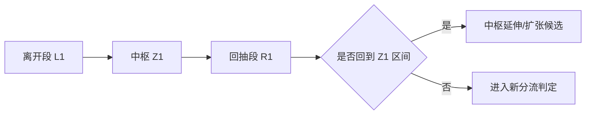
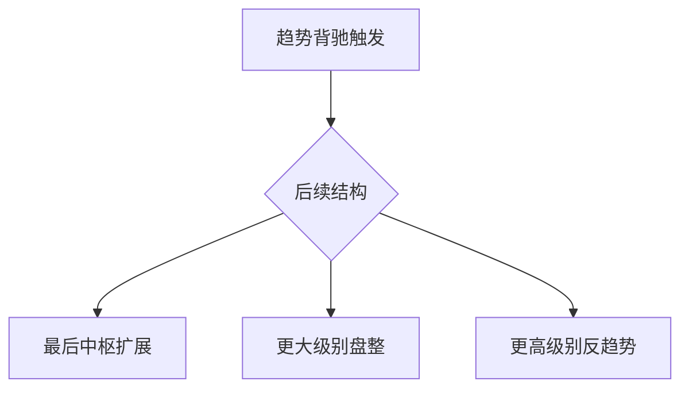
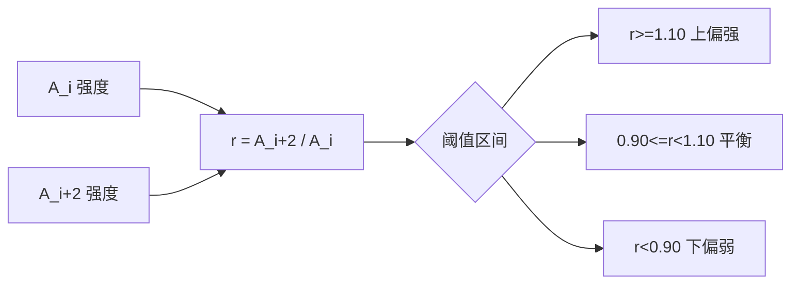
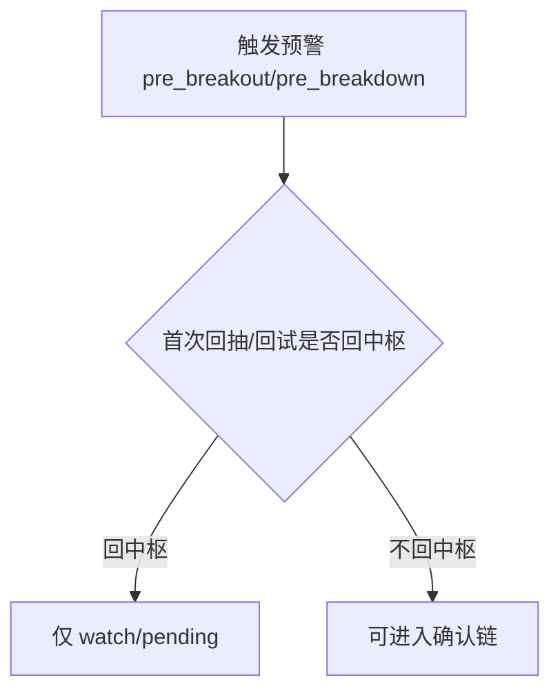

# 中枢图文化示例库（V1）

本页提供“中枢主口径 + 类中枢辅口径”的图文化示例模板，服务于培训、复盘和发布层解释统一。

使用原则：

- 所有示例先给中枢主结论，再给类中枢辅助结论。
- 预警不等于确认，图文必须显式区分 `watch/pending` 与 `confirmed`。
- 若主辅冲突，图注中必须出现“中枢主口径优先”。

## 1. 第18/20课：中枢定理与扩张示例

场景目标：演示“中枢可扩张，但未必立即切分为新走势类型”。

图注模板：

- 主结论：当前更接近中枢延伸，走势类型边界待稳定。
- 辅结论：类中枢给出更激进切分，仅作辅助观察。

## 2. 第29课：背驰后三级去向示例

场景目标：演示背驰后只允许三类去向。

图注模板：

- 必填字段：`post_divergence_route`、`route_level_from`、`route_level_to`。
- 禁止文案：不得出现“第四种去向”。

## 3. 第39课：A_i 与 A_i+2 节奏示例

场景目标：演示力度比 `r` 只用于节奏监视，不直接确认买卖点。

图注模板：

- `oscillation_rhythm_state=up_bias|balanced|down_bias|pending`
- 结论降级：若 `dual_interpretation_pending`，仅输出观察态。

## 4. 第92课：监视器预警但未确认示例

场景目标：演示 `pre_breakout/pre_breakdown` 与 `confirmed_3B/3S` 的边界。

图注模板：

- 若首次回抽/回试回中枢：`不得输出 confirmed`。
- 若条件未闭合：`高风险观察，待确认`。

## 5. 发布层最小图文检查清单

- 是否同时展示“上一个已完成结构 + 当前进行结构”。
- 是否区分中枢（主）与类中枢（辅）图层/图例。
- 是否在预警场景下避免使用“已确认买卖点”措辞。
- 是否在主辅冲突时显示“中枢主口径优先”。

## 6. 实盘案例卡片模板（可直接填充）

以下模板用于把“示意流程图”升级成“可复核案例卡片”。

### 6.1 定理与扩张卡片（第18/20课）

- 标的/级别/时间窗：
- 主结构结论：中枢延伸 | 中枢扩张 | 新走势候选
- 关键证据：`ZG/ZD/GG/DD`、`is_terminated`、`post_divergence_route`
- 主辅差异：
- 最终文案：

### 6.2 背驰后去向卡片（第29课）

- 标的/级别/时间窗：
- 去向判定：`last_zs_extension | higher_level_range | higher_level_reverse_trend`
- 级别映射：`route_level_from` -> `route_level_to`
- 是否满足级别闭合：是 | 否
- 最终文案：

### 6.3 节奏阈值卡片（第39课）

- 标的/级别/时间窗：
- `A_i` 强度：
- `A_{i+2}` 强度：
- `r` 值与阈值区间：
- `oscillation_rhythm_state`：
- 是否触发降级：是 | 否

### 6.4 预警未确认卡片（第92课）

- 标的/级别/时间窗：
- 预警类型：`pre_breakout | pre_breakdown`
- 首次回抽/回试是否回中枢：是 | 否
- 信号等级：watch/pending | confirmed
- 最终文案：

## 7. 配套文档跳转

- 阈值回放记录模板：`rhythm-replay-log-template.md`
- 发布层统一文案接入清单：`../analysis/publish-snippet-adoption-checklist.md`
- 首批样例包（已填充）：`sample-case-pack-2026-08-v1.md`
- 首批阈值回放记录（已填充）：`rhythm-replay-log-2026-08-first-batch.md`
- 首批文案抽检记录（已填充）：`../analysis/publish-snippet-audit-2026-08-first-batch.md`
- 第二批样例包（已填充）：`sample-case-pack-2026-08-v2.md`
- 第二批阈值回放记录（已填充）：`rhythm-replay-log-2026-08-second-batch.md`
- 第二批文案抽检记录（已填充）：`../analysis/publish-snippet-audit-2026-08-second-batch.md`
